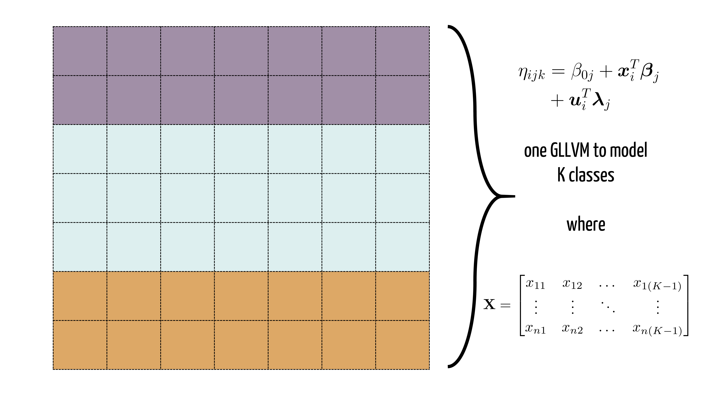
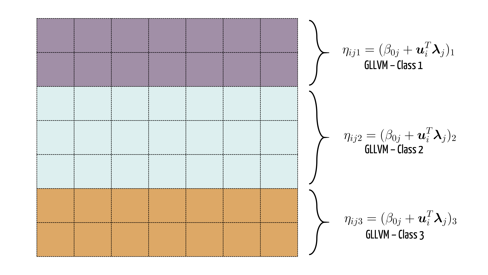
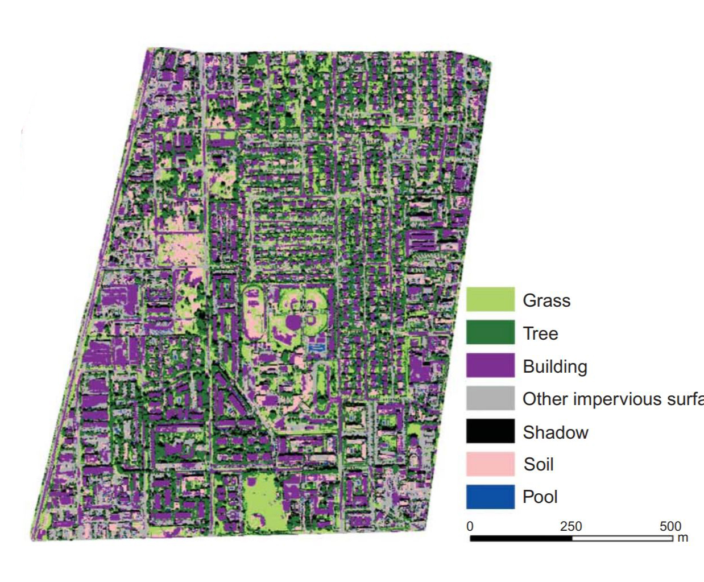
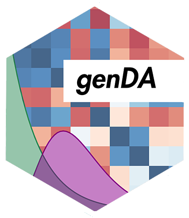

```{r setup, include=FALSE}
options(htmltools.dir.version = FALSE)
library(ggplot2)
library(plotly)
library(dplyr)
livedemosign <- function(top, left, deg) {
  htmltools::div("Live Demo!", class="faa-flash animated",
                 style=glue::glue("border:solid; border-color:black; position:absolute; top:{top}%; left:{left}%; font-size:36px; padding:4px; background-color:white; color:black;transform:rotate({deg}deg);")
                 )
}

```


class: split-40 hide-slide-number with-thick-border border-white
background-image: url("bkg/bg1.png")
background-size: cover

.column[.content.vmiddle.center[


]]
.column.shade_main[.content.vmiddle[

<br>

# .large[genDA]
## A Discriminant Analysis Method for Large Scale 
## and Complex Datasets

<br>

### Sarah Romanes  `r anicon::faa('twitter', animate = 'float', rtext='sarah_romanes', color='white')` 

<br>

### J.B Douglas Award, 2019

### `r anicon::faa('link', animate='vertical', rtext='&nbsp;bit.ly/SR-YoungStats', color='white')`


]]


---

class: split-33 white

.row.bg-main5[.content.vmiddle.center[
# .white[There is a growing need for interpretable ML]
]]

.row.bg-main2[.content[
.split-three[
.column.bg-main2[.content.vmiddle.center[
     # `r icon::fa("dna", size=4)` 
     ]]
.column.bg-main2[.content.vmiddle.center[
      # `r icon::fa("file-medical", size=4)` 
     ]]
 .column.bg-main2[.content.vmiddle.center[
      # `r icon::fa("gavel", size=4)` 
     ]]
]]]

---


class: split-70 hide-slide-number
background-image: url("bkg/bg3.png")
background-size: cover

.column.slide-in-left[
.sliderbox.vmiddle.shade_main.center[
.font5[Discriminant Analysis]]]
.column[
]


---
class: split-two white

.column.bg-main2[.content[

<br>

# **What is Discriminant Analysis?**

<br>

### `r icon::fa("angle-right", size=1)`  Discriminant Analysis (Fisher, 1936) is a ML technique that seeks to find a linear combination of features that separates classes of objects.
<br>

### `r icon::fa("angle-right", size=1)`   It *strictly* assumes the conditional distribution of the data, given class grouping, is .orange[multivariate normal].

<br>

### `r icon::fa("angle-right", size=1)`   Available through `MASS` package in `r icon::fa("r-project", size=1)` with functions `lda` (common covariance) and `qda`. 


]]
.column.bg-main5[.content.vmiddle.center[


```{r, fig.retina=4, echo=FALSE, warning=FALSE, message=FALSE, dev='svg',dev.args   = list(bg = 'transparent')}
library(tidyverse)
library(mvtnorm)
library(ochRe)

s <- matrix(c(4,2,2,3), ncol = 2)
s1 <- matrix(c(3, -0.6,-0.6, 1), ncol=2)
s2 <- matrix(c(2,-0.08,-0.08,1), ncol = 2)

m1 <- c(0, 0)
m2 <- c(-3, 4)
m3 <- c(2,3)
n <- 1000

set.seed(42)
x1 <- rmvnorm(n = n, mean = m1, sigma = s2)
x2 <- rmvnorm(n = n, mean = m2, sigma = s1)
x3 <- rmvnorm(n = n, mean = m3, sigma = s)


d <- data.frame(rbind(x1,x2,x3))
d$class <- as.factor(rep(c("1", "2", "3"), each = 1000))

my_colours = c(ochre_palettes$namatjira_div[c(5,4)], "#ffffff")
p2 <- ggplot(d, aes(x = X1, y = X2, group = class, color =class)) +
  geom_point(alpha = .5) +
  geom_density_2d() + 
  scale_color_manual(values = my_colours) + theme_minimal() +
  theme(
    panel.background  = element_rect(fill = 'transparent', colour = NA),
    plot.background   = element_rect(fill = 'transparent', colour = NA),
    legend.background = element_rect(fill = 'transparent', colour = NA),
    legend.key        = element_rect(fill = 'transparent', colour = NA),
    axis.title        = element_text(size = 18),
    axis.text         = element_text(size = 16),
    strip.text        = element_text(size = 20)
  )


p2
  
```


 

]]


---

class: split-two white

.column.bg-main2[.content[

<br>

# **Advantages**

<br>
<br>

## `r icon::fa("check", size=1)` Intuitive, and easy to use.

<br>

## `r icon::fa("check", size=1)` Describes data generating process as well as provide a classifier for new points.

<br>

<br>

# .orange[**but...**]

]]
.column.bg-main5[.content[

<br>

# **Disadvantages**

<br>

## `r icon::fa("times", size=1)` Does not work when $p > n$ due to MLE covariance matrix estimates being singular.

<br>

## `r icon::fa("times", size=1)` Does not work for non-Normal data types.

<br>

]]


---

class: middle center hide-slide-number
background-image: url("bkg/bg2.png")
background-size: cover

# .black[`r icon::fa("question", size=3)`]


---

class: split-60 hide-slide-number
background-image: url("bkg/bg2.png")
background-size: cover


.column.slide-in-right[
.sliderbox.vmiddle.shade_main.center[
.font5[ for GLLVMs  `r icon::fa("thumbs-up", size=1)`]]]
.column[
]

.column.slide-in-left[
.sliderbox.shade_main.center[
.font5[Swap multivariate Normals ]]]
.column[
]

---

class: split-two 

.column.bg-main2[.content[

<br>

## ** Generalised Linear Latent Variable Models**

<br>

### `r icon::fa("angle-right", size=1)` Let $\mathbf{Y}$ denote a $n \times m$ response matrix. 
### `r icon::fa("angle-right", size=1)` Let $\mathbf{X}$ denote a design matrix of class information for each observation. 

### `r icon::fa("angle-right", size=1)` In a GLLVM, the mean responses are regressed against a .orange[vector of] $\color{orange}{d \ll m}$ .orange[latent variables] $\color{orange}{\mathbf{u}_i}$ along with the class covariates.

]]
.column[.content.vmiddle.center[


.large[.black[

$$g(\mu_{ij}) = \eta_{ij} = \beta_0 + \mathbf{x}_i^T\boldsymbol{\beta}_j  \color{orange}{ + \mathbf{u}_i^T\boldsymbol{\lambda}_j }$$ 

]]

### .black[*where*]

.large[.black[
$$\mathbf{u}_i \sim \mathcal{N}(\mathbf{0}, \mathbf{I}_d)$$  ]]

]]


---
class: split-two 

.column.bg-main2[.content[

<br>

## ** Generalised Linear Latent Variable Models**
<br>

### `r icon::fa("angle-right", size=1)`  To complete the formulation we assume that conditional on the latent variables $\mathbf{u}_i$ and parameter vector $\boldsymbol{\Psi}$, the responses are independent observations from the exponential family of distributions.

<br>

### `r icon::fa("angle-right", size=1)` .orange[**We can capture differing response types through altering the exponential family representation for each column as needed**]

]]
.column[.content.vmiddle.center[


.medium[.black[

$$p(y_{ij}| \mathbf{u}_i, \boldsymbol{\Psi}) = \left\{ \frac{y_{ij} (\eta_{ij}) - b_j(\eta_{ij}) }{a_j(\phi_j)} + c_j(y_{ij}, \phi_j)  \right\}$$

]]


]]


---

class: split-33 

.column.bg-main2[.content[

<br>

# ** GLLVMs for DA **

<br>

## .orange[*Common Covariance*]

<br>

## In the common covariance model, class information is captured in $\mathbf{x}_i$. 


]]
.column[.content.vmiddle.center[


 


]]
---

class: split-33 

.column.bg-main2[.content[

<br>

# ** GLLVMs for DA **

<br>

## .orange[*Separate Covariance*]

<br>

## We can model .orange[differing] correlation structures by fitting multiple GLLVMs for different classes.


]]
.column[.content.vmiddle.center[


 


]]


---

class: split-two 

.column.bg-main2[.content[

<br>

# ** Estimating GLLVMs **

## `r icon::fa("angle-right", size=1)`  To obtain estimates for $\boldsymbol{\Psi}$, we must first marginalise over the latent variables $\mathbf{u}_i$ as they are unobserved.


]]
.column[.content.vmiddle.center[


.medium[.black[

$$\begin{align}
      \ell(\boldsymbol{\Psi}) & = \sum_{i=1}^n \log \left\{p(\mathbf{y}_i, \boldsymbol{\Psi}) \right\} \\
                              & = \sum_{i=1}^n \log \left( \int \prod_{i=1}^{m} p(y_{ij}| \mathbf{u}_i,\boldsymbol{\Psi}) p(\mathbf{u}_i) d \mathbf{u}_i \right)
   \end{align}$$
]]


]]


---

class: split-two 

.column.bg-main2[.content[

<br>

# ** Estimating GLLVMs **

## `r icon::fa("angle-right", size=1)`  To obtain estimates for $\boldsymbol{\Psi}$, we must first marginalise over the latent variables $\mathbf{u}_i$ as they are unobserved.


## `r icon::fa("angle-right", size=1)`  However, the integral needed to obtain the marginal likelihood proves to be intractable. 


]]
.column[.content.vmiddle.center[


.medium[.black[

$$\begin{align}
      \ell(\boldsymbol{\Psi}) & = \sum_{i=1}^n \log \left\{p(\mathbf{y}_i, \boldsymbol{\Psi}) \right\} \\
                              & = \sum_{i=1}^n \log \left( \int \prod_{i=1}^{m} p(y_{ij}| \mathbf{u}_i,\boldsymbol{\Psi}) p(\mathbf{u}_i) d \mathbf{u}_i \right)
   \end{align}$$
]]

<br>

# .red[`r anicon::faa('ban', animate='flash', size = 3, speed = "slow")`]

]]

---

class: split-two 

.column.bg-main2[.content[

<br>

# ** Estimating GLLVMs **

## `r icon::fa("angle-right", size=1)`  To obtain estimates for $\boldsymbol{\Psi}$, we must first marginalise over the latent variables $\mathbf{u}_i$ as they are unobserved.


## `r icon::fa("angle-right", size=1)`  However, the integral needed to obtain the marginal likelihood proves to be intractable. .orange[How do we overcome this?]


]]
.column[.content.vmiddle.center[


.medium[.black[

$$\begin{align}
      \ell(\boldsymbol{\Psi}) & = \sum_{i=1}^n \log \left\{p(\mathbf{y}_i, \boldsymbol{\Psi}) \right\} \\
                              & = \sum_{i=1}^n \log \left( \int \prod_{i=1}^{m} p(y_{ij}| \mathbf{u}_i,\boldsymbol{\Psi}) p(\mathbf{u}_i) d \mathbf{u}_i \right)
   \end{align}$$
]]

<br>

# .red[`r anicon::faa('ban', animate='flash', size = 3, speed = "slow")`]

]]
---
class: center bg-main2

<br>

# Variational Approximations to the rescue!

<br>


---

class: middle center hide-slide-number
background-image: url("images/VA.png")
background-size: cover


---

class: split-two 

.column.bg-main2[.content[

<br>

# **VA for GLLVMs **

<br>

### `r icon::fa("angle-right", size=1)`  Hui et al. (2017) show that it is optimal to pick $q(\mathbf{u}_i) \sim \mathcal{N}_d(\boldsymbol{\mu}_i, \boldsymbol{\Sigma}_i)$, leading to the following expression for the variational lower bound for the approximate marginal log likelihood.

<br>

###.orange.center[Maximising the approximate lower bound is equivalent to minimising KL divergence between approximation and true marginal likelihood.]


]]
.column[.content.vmiddle.center[


.mediumIsh[.black[

$$\begin{align}
      \underline{\ell}(\boldsymbol{\Psi}, \boldsymbol{\xi}) & = \sum_{i=1}^n \sum_{j=1}^{m}  \left\{ \frac{y_{ij} \widetilde{\eta}_{ij} - E_q\{b(\eta_{ij}) \}}{a(\phi_j)} + c(y_{ij}, \phi_j)  \right\} \\
                              & + \frac{1}{2} \sum_{i=1}^{n} ( \log \det(\boldsymbol{\Sigma}_i) - \mbox{tr}(\boldsymbol{\Sigma}_i) - \boldsymbol{\mu}_i^T\boldsymbol{\mu}_i ),
   \end{align}$$
]]

### .black[*where*]

.medium[.black[
$$\widetilde{\eta}_{ij} = \beta_{0j} + \mathbf{x}_i^T\boldsymbol{\beta}_j  + \boldsymbol{\mu}_i^T\boldsymbol{\lambda}_j$$  ]]


]]


---

class: split-two 

.column.bg-main2[.content[

<br>

# **VA for GLLVMs **

<br>

### `r icon::fa("angle-right", size=1)`  Hui et al. (2017) show that it is optimal to pick $q(\mathbf{u}_i) \sim \mathcal{N}_d(\boldsymbol{\mu}_i, \boldsymbol{\Sigma}_i)$, leading to the following expression for the variational lower bound for the approximate marginal log likelihood.

<br>

###.orange.center[However, a direct implementation of this approximation is not feasible for a few key reasons.]


]]
.column[.content.vmiddle.center[


.mediumIsh[.black[

$$\begin{align}
      \underline{\ell}(\boldsymbol{\Psi}, \boldsymbol{\xi}) & = \sum_{i=1}^n \sum_{j=1}^{m}  \left\{ \frac{y_{ij} \widetilde{\eta}_{ij} - E_q\{b(\eta_{ij}) \}}{a(\phi_j)} + c(y_{ij}, \phi_j)  \right\} \\
                              & + \frac{1}{2} \sum_{i=1}^{n} ( \log \det(\boldsymbol{\Sigma}_i) - \mbox{tr}(\boldsymbol{\Sigma}_i) - \boldsymbol{\mu}_i^T\boldsymbol{\mu}_i ),
   \end{align}$$
]]

### .black[*where*]

.medium[.black[
$$\widetilde{\eta}_{ij} = \beta_{0j} + \mathbf{x}_i^T\boldsymbol{\beta}_j  + \boldsymbol{\mu}_i^T\boldsymbol{\lambda}_j$$  ]]


]]

---
class: split-two 

.column.bg-main2[.content[

<br>

# **VA for GLLVMs **

<br>

### `r icon::fa("angle-right", size=1)`  Hui et al. (2017) show that it is optimal to pick $q(\mathbf{u}_i) \sim \mathcal{N}_d(\boldsymbol{\mu}_i, \boldsymbol{\Sigma}_i)$, leading to the following expression for the variational lower bound for the approximate marginal log likelihood.

<br>

###.orange.center[However, a direct implementation of this approximation is not feasible for a few key reasons.]


]]
.column[.content.vmiddle.center[


.mediumIsh[.black[

$$\begin{align}
      \underline{\ell}(\boldsymbol{\Psi}, \boldsymbol{\xi}) & = \sum_{i=1}^n \sum_{j=1}^{m}  \left\{ \frac{y_{ij} \widetilde{\eta}_{ij} - E_q\{b(\eta_{ij}) \}}{a(\phi_j)} + c(y_{ij}, \phi_j)  \right\} \\
                              & + \frac{1}{2} \sum_{i=1}^{n} ( \log \det(\boldsymbol{\Sigma}_i) - \mbox{tr}(\boldsymbol{\Sigma}_i) - \boldsymbol{\mu}_i^T\boldsymbol{\mu}_i ),
   \end{align}$$
]]

### .black[*where*]

.medium[.black[
$$\widetilde{\eta}_{ij} = \beta_{0j} + \mathbf{x}_i^T\boldsymbol{\beta}_j  + \boldsymbol{\mu}_i^T\boldsymbol{\lambda}_j$$  ]]


]]

<div class="shade_lpurple" style="width:40%; position: absolute; top: 4%; right:2%;border-radius: 12px;" >
<br>
<center>
  <h3>
    1) `r icon::fa("r-project", size=1)` package <code>gllvm</code> only supports single family response
  </h3>
  </center>
  <br>
</div>


---

class: split-two 

.column.bg-main2[.content[

<br>

# **VA for GLLVMs **

<br>

### `r icon::fa("angle-right", size=1)`  Hui et al. (2017) show that it is optimal to pick $q(\mathbf{u}_i) \sim \mathcal{N}_d(\boldsymbol{\mu}_i, \boldsymbol{\Sigma}_i)$, leading to the following expression for the variational lower bound for the approximate marginal log likelihood.

<br>

###.orange.center[However, a direct implementation of this approximation is not feasible for a few key reasons.]


]]
.column[.content.vmiddle.center[


.mediumIsh[.black[

$$\begin{align}
      \underline{\ell}(\boldsymbol{\Psi}, \boldsymbol{\xi}) & = \sum_{i=1}^n \sum_{j=1}^{m}  \left\{ \frac{y_{ij} \widetilde{\eta}_{ij} -\color{orange}{ E_q\{b(\eta_{ij}) \}}  }{a(\phi_j)} + c(y_{ij}, \phi_j)  \right\} \\
                              & + \frac{1}{2} \sum_{i=1}^{n} ( \log \det(\boldsymbol{\Sigma}_i) - \mbox{tr}(\boldsymbol{\Sigma}_i) - \boldsymbol{\mu}_i^T\boldsymbol{\mu}_i ),
   \end{align}$$
]]

### .black[*where*]

.medium[.black[
$$\widetilde{\eta}_{ij} = \beta_{0j} + \mathbf{x}_i^T\boldsymbol{\beta}_j  + \boldsymbol{\mu}_i^T\boldsymbol{\lambda}_j$$  ]]


]]

<div class="shade_lpurple" style="width:40%; position: absolute; top: 4%; right:2%;border-radius: 12px;" >
<br>
<center>
  <h3>
    2) Expectation not guaranteed to have closed form
  </h3>
  </center>
  <br>
</div>

---


class: split-two 

.column.bg-main2[.content[

<br>

# **VA for GLLVMs **

<br>

### `r icon::fa("angle-right", size=1)`  Hui et al. (2017) show that it is optimal to pick $q(\mathbf{u}_i) \sim \mathcal{N}_d(\boldsymbol{\mu}_i, \boldsymbol{\Sigma}_i)$, leading to the following expression for the variational lower bound for the approximate marginal log likelihood.

<br>

###.orange.center[However, a direct implementation of this approximation is not feasible for a few key reasons.]


]]
.column[.content.vmiddle.center[


.mediumIsh[.black[

$$\begin{align}
      \underline{\ell}(\boldsymbol{\Psi}, \boldsymbol{\xi}) & = \sum_{i=1}^n \sum_{j=1}^{m}  \left\{ \frac{y_{ij} \widetilde{\eta}_{ij} -E_q\{b(\eta_{ij}) \}  }{a(\phi_j)} + c(y_{ij}, \phi_j)  \right\} \\
                              & + \frac{1}{2} \sum_{i=1}^{n} ( \log \det( \color{orange}{   \boldsymbol{\Sigma}_i}) - \mbox{tr}(\color{orange}{ \boldsymbol{\Sigma}_i}) - \boldsymbol{\mu}_i^T\boldsymbol{\mu}_i ),
   \end{align}$$
]]

### .black[*where*]

.medium[.black[
$$\widetilde{\eta}_{ij} = \beta_{0j} + \mathbf{x}_i^T\boldsymbol{\beta}_j  + \boldsymbol{\mu}_i^T\boldsymbol{\lambda}_j$$  ]]


]]

<div class="shade_lpurple" style="width:40%; position: absolute; top: 4%; right:2%;border-radius: 12px;" >
<br>
<center>
  <h3>
    3) Difficult to optimise for covariance matrices
  </h3>
  </center>
  <br>
</div>


---

class: split-two 

.column.bg-main2[.content[

<br>

# **VA for GLLVMs **

<br>

### `r icon::fa("angle-right", size=1)`  Hui et al. (2017) show that it is optimal to pick $q(\mathbf{u}_i) \sim \mathcal{N}_d(\boldsymbol{\mu}_i, \boldsymbol{\Sigma}_i)$, leading to the following expression for the variational lower bound for the approximate marginal log likelihood.

<br>

###.orange.center[However, a direct implementation of this approximation is not feasible for a few key reasons.]


]]
.column[.content.vmiddle.center[


.mediumIsh[.black[

$$\begin{align}
      \underline{\ell}(\boldsymbol{\Psi}, \boldsymbol{\xi}) & = \sum_{i=1}^n \sum_{j=1}^{m}  \left\{ \frac{y_{ij} \widetilde{\eta}_{ij} -E_q\{b(\eta_{ij}) \}  }{a(\phi_j)} + c(y_{ij}, \phi_j)  \right\} \\
                              & + \frac{1}{2} \sum_{i=1}^{n} ( \log \det(   \boldsymbol{\Sigma}_i) - \mbox{tr}( \boldsymbol{\Sigma}_i) - \boldsymbol{\mu}_i^T\boldsymbol{\mu}_i ),
   \end{align}$$
]]

### .black[*where*]

.medium[.black[
$$\widetilde{\eta}_{ij} = \beta_{0j} + \mathbf{x}_i^T\boldsymbol{\beta}_j  + \boldsymbol{\mu}_i^T\boldsymbol{\lambda}_j$$  ]]


]]

<div class="shade_lpurple" style="width:40%; position: absolute; top: 4%; right:2%;border-radius: 12px;" >
<br>
<center>
  <h3>
    4) No regularisation of model parameters
  </h3>
  </center>
  <br>
</div>

---
class: bg-main2 middle center

# **Some adjustments are necessary!**

<br>

# .white[`r anicon::faa('wrench', animate='wrench', size = 5, speed = "slow")`]


---

class: split-two 

.column.bg-main2[.content[

<br>

# A Bayesian GLLVM `r icon::fa("lightbulb", size=1)`

<br>

## A twist we will add, in comparison to previous work, is approach this from a .orange[*Bayesian*] framework, with the priors on our coefficients allowing us to incorporate .orange[*regularisation*] in the fitting process. 

<br>

## We use the following prior specification:

]]
.column[.content.vmiddle.center[

.large[.black[

$$\begin{align}
      \beta_{0} \sim \mathcal{N}(\mathbf{0}, \sigma^2_{\beta_{0}}\mathbf{I}), \\
      \boldsymbol{\beta}_j \sim  \mathcal{N}(\mathbf{0}, \sigma^2_{\beta_{j}}\mathbf{I}), \\
      \boldsymbol{\lambda}_j \sim  \mathcal{N}(\mathbf{0}, \sigma^2_{\lambda_{j}}\mathbf{I}),
   \end{align}$$
]]

.black[### and for the dispersion parameter(if applicable)]
.large[.black[

$$\begin{align}
p(\phi_j) \propto 1.
   \end{align}$$
]]


]]


---

class: split-33

.column.bg-main2[.content[

<br>

# A Bayesian GLLVM `r icon::fa("lightbulb", size=1)`

<br>

### We consider the following parameterisation to construct our variational lower bound, where we assume both $q$ densities are multivariate normal.


]]
.column[.content.vmiddle.center[

.larger[.black[

$$\begin{align}
q(\mathbf{u}, \boldsymbol{\Psi}) = \prod_{i=1}^{n} q(\mathbf{u}_i)q(\boldsymbol{\Psi})
\end{align}$$

]]


]]

---

class: split-33

.column.bg-main2[.content[

<br>

# A Bayesian GLLVM `r icon::fa("lightbulb", size=1)`

<br>

### We can then construct our variational lower bound as follows:


]]
.column[.content.vmiddle.center[

.black[

$$\begin{align}
		\log \underline{p}(\mathbf{Y}, \mathbf{X}, \boldsymbol{\Psi}, \boldsymbol{\xi}) &  = \sum_{i=1}^n \Big\{  (\mathbf{y}_{i} \odot a(\boldsymbol{\phi})^{-1})^T(  \boldsymbol{\beta}_{0} + \mathbf{B}\mathbf{x}_i + \mathbf{L}\boldsymbol{\mu}_i)  \\
		& - (a(\boldsymbol{\phi})^{-1})^T E_{\mathbf{u}_i} \left( b(\boldsymbol{\beta}_{0} + \mathbf{B}\mathbf{x}_i + \mathbf{L}\mathbf{u}_i) \right) + \mathbf{1}^Tc(\mathbf{y}_i, \boldsymbol{\phi}) \Big\}\\	
		& +  \sum_{i=1}^{n} \tfrac{1}{2}\left( \log |\boldsymbol{\Sigma}_i| - \mbox{tr}(\boldsymbol{\Sigma}_i) - \|\boldsymbol{\mu}_i\|^2 \right) \\
		&- \frac{\|\boldsymbol{\beta}_0\|^2}{2\sigma_\beta^2} - \sum_{j=1}^m \frac{\|\boldsymbol{\beta}_j\|^2}{2\sigma_\beta^2}- \sum_{j=1}^m \frac{\|\boldsymbol{\lambda}_j\|^2}{2\sigma_\lambda^2}.
   \end{align}$$
]

]]
---

class: split-33

.column.bg-main2[.content[

<br>

# A Bayesian GLLVM `r icon::fa("lightbulb", size=1)`

<br>

### We can then construct our variational lower bound as follows:


]]
.column[.content.vmiddle.center[

.black[

$$\begin{align}
		\log \underline{p}(\mathbf{Y}, \mathbf{X}, \boldsymbol{\Psi}, \boldsymbol{\xi}) &  = \sum_{i=1}^n \Big\{  (\mathbf{y}_{i} \odot a(\boldsymbol{\phi})^{-1})^T(  \boldsymbol{\beta}_{0} + \mathbf{B}\mathbf{x}_i + \mathbf{L}\boldsymbol{\mu}_i)  \\
		& - (a(\boldsymbol{\phi})^{-1})^T \color{orange}{E_{\mathbf{u}_i} \left( b(\boldsymbol{\beta}_{0} + \mathbf{B}\mathbf{x}_i + \mathbf{L}\mathbf{u}_i) \right)} + \mathbf{1}^Tc(\mathbf{y}_i, \boldsymbol{\phi}) \Big\}\\	
		& +  \sum_{i=1}^{n} \tfrac{1}{2}\left( \log |\boldsymbol{\Sigma}_i| - \mbox{tr}(\boldsymbol{\Sigma}_i) - \|\boldsymbol{\mu}_i\|^2 \right) \\ & -\frac{\|\boldsymbol{\beta}_0\|^2}{2\sigma_\beta^2} - \sum_{j=1}^m \frac{\|\boldsymbol{\beta}_j\|^2}{2\sigma_\beta^2}- \sum_{j=1}^m \frac{\|\boldsymbol{\lambda}_j\|^2}{2\sigma_\lambda^2}.
   \end{align}$$
]

]]

<div class="shade_lpurple" style="width:40%; position: absolute; top: 4%; right:2%;border-radius: 12px;" >
<br>
<center>
  <h3>
    Note - we still have expectation terms remaining
  </h3>
  </center>
  <br>
</div>


---

class: split-33

.column.bg-main2[.content[

<br>

# A Bayesian GLLVM `r icon::fa("lightbulb", size=1)`

<br>

### We can then construct our variational lower bound as follows:

<br>

### .orange[We can over come this by applying a *second order delta method approximation* of the form:]

.white[

$$\begin{align}
	E(f(\mathbf{X})) & \approx f(E(\mathbf{X})) \\
	& + \tfrac{1}{2}\mbox{tr}\left[\mathbf{H}(E(\mathbf{X}))\mbox{Cov}(\mathbf{X})\right].
   \end{align}$$
]

### .orange[to obtain:]


]]
.column[.content.vmiddle.center[

.black[

$$\begin{align}
		\log \underline{p}(\mathbf{Y}, \mathbf{X}, \boldsymbol{\Psi}, \boldsymbol{\xi}) &  = \sum_{i=1}^n \Big\{  (\mathbf{y}_{i} \odot a(\boldsymbol{\phi})^{-1})^T(  \boldsymbol{\beta}_{0} + \mathbf{B}\mathbf{x}_i + \mathbf{L}\boldsymbol{\mu}_i)  \\
		& - (a(\boldsymbol{\phi})^{-1})^T \color{orange}{E_{\mathbf{u}_i} \left( b(\boldsymbol{\beta}_{0} + \mathbf{B}\mathbf{x}_i + \mathbf{L}\mathbf{u}_i) \right)} + \mathbf{1}^Tc(\mathbf{y}_i, \boldsymbol{\phi}) \Big\}\\	
		& +  \sum_{i=1}^{n} \tfrac{1}{2}\left( \log |\boldsymbol{\Sigma}_i| - \mbox{tr}(\boldsymbol{\Sigma}_i) - \|\boldsymbol{\mu}_i\|^2 \right) \\ & -\frac{\|\boldsymbol{\beta}_0\|^2}{2\sigma_\beta^2} - \sum_{j=1}^m \frac{\|\boldsymbol{\beta}_j\|^2}{2\sigma_\beta^2}- \sum_{j=1}^m \frac{\|\boldsymbol{\lambda}_j\|^2}{2\sigma_\lambda^2}.
   \end{align}$$
]

]]

<div class="shade_lpurple" style="width:40%; position: absolute; top: 4%; right:2%;border-radius: 12px;" >
<br>
<center>
  <h3>
    Note - we still have expectation terms remaining
  </h3>
  </center>
  <br>
</div>


---

class: split-33

.column.bg-main2[.content[

<br>

# A Bayesian GLLVM `r icon::fa("lightbulb", size=1)`

<br>

### We can then construct our variational lower bound as follows:

<br>

]]
.column[.content.vmiddle.center[

.black[

$$\begin{align}
	\log \underline{p}(\mathbf{Y}, \mathbf{X}, \boldsymbol{\Psi}, \boldsymbol{\xi}) & \approx  \sum_{i=1}^n \Big[ (\mathbf{y}_{i} \odot a(\boldsymbol{\phi})^{-1})^T(  \boldsymbol{\beta}_{0} + \mathbf{B}\mathbf{x}_i + \mathbf{L}\boldsymbol{\mu}_i)  \\ & -  (a(\boldsymbol{\phi})^{-1})^T b(  \boldsymbol{\beta}_{0} + \mathbf{B}\mathbf{x}_i + \mathbf{L}\boldsymbol{\mu}_i) + \mathbf{1}^Tc(\mathbf{y}_i, \boldsymbol{\phi}) \\& - \tfrac{1}{2}\mbox{tr}\left( \color{orange}{\boldsymbol{\Sigma}_i} \left( \mathbf{L}^T \mbox{diag}(a(\boldsymbol{\phi})^{-1} \odot b''( \boldsymbol{\beta}_{0} + \mathbf{B}\mathbf{x}_i + \mathbf{L}\boldsymbol{\mu}_i)) \mathbf{L} + \mathbf{I} \right)\right)\\& +    \tfrac{1}{2}\left( \log |\color{orange}{\boldsymbol{\Sigma}_i}| - \mbox{tr}(\color{orange}{\boldsymbol{\Sigma}_i}) - \|\boldsymbol{\mu}_i\|^2 \right) \Big]  \\ & - \frac{\|\boldsymbol{\beta}_0\|^2}{2\sigma_\beta^2}- \sum_{j=1}^m \frac{\|\boldsymbol{\beta}_j\|^2}{2\sigma_\beta^2}- \sum_{j=1}^m \frac{\|\boldsymbol{\lambda}_j\|^2}{2\sigma_\lambda^2}.
\end{align}$$
]


]]

<div class="shade_lpurple" style="width:40%; position: absolute; top: 4%; right:2%;border-radius: 12px;" >
<br>
<center>
  <h3>
    The covariance terms still remain, and need to be removed
  </h3>
  </center>
  <br>
</div>
---
class: split-33

.column.bg-main2[.content[

<br>

# A Bayesian GLLVM `r icon::fa("lightbulb", size=1)`

<br>

### We can then construct our variational lower bound as follows:

<br>

### .orange[We adopt a *profile likelihood* type approach to first optermize over the covariance terms. First order optimality conditions imply]

.small[.white[

$$\begin{align}
\widehat{\boldsymbol{\Sigma}}_i = 
	\left[  \mathbf{L}^T \mbox{diag}(a(\boldsymbol{\phi})^{-1} \odot b''( \boldsymbol{\beta}_{0} + \mathbf{B}\mathbf{x}_i + \mathbf{L}\boldsymbol{\mu}_i)) \mathbf{L}+ \mathbf{I} \right]^{-1}
   \end{align}$$
]]


]]
.column[.content.vmiddle.center[

.black[

$$\begin{align}
	\log \underline{p}(\mathbf{Y}, \mathbf{X}, \boldsymbol{\Psi}, \boldsymbol{\xi}) & \approx  \sum_{i=1}^n \Big[ (\mathbf{y}_{i} \odot a(\boldsymbol{\phi})^{-1})^T(  \boldsymbol{\beta}_{0} + \mathbf{B}\mathbf{x}_i + \mathbf{L}\boldsymbol{\mu}_i)  \\ & -  (a(\boldsymbol{\phi})^{-1})^T b(  \boldsymbol{\beta}_{0} + \mathbf{B}\mathbf{x}_i + \mathbf{L}\boldsymbol{\mu}_i) + \mathbf{1}^Tc(\mathbf{y}_i, \boldsymbol{\phi}) \\& - \tfrac{1}{2}\mbox{tr}\left( \color{orange}{\boldsymbol{\Sigma}_i} \left( \mathbf{L}^T \mbox{diag}(a(\boldsymbol{\phi})^{-1} \odot b''( \boldsymbol{\beta}_{0} + \mathbf{B}\mathbf{x}_i + \mathbf{L}\boldsymbol{\mu}_i)) \mathbf{L} + \mathbf{I} \right)\right)\\& +    \tfrac{1}{2}\left( \log |\color{orange}{\boldsymbol{\Sigma}_i}| - \mbox{tr}(\color{orange}{\boldsymbol{\Sigma}_i}) - \|\boldsymbol{\mu}_i\|^2 \right) \Big]  \\ & - \frac{\|\boldsymbol{\beta}_0\|^2}{2\sigma_\beta^2}- \sum_{j=1}^m \frac{\|\boldsymbol{\beta}_j\|^2}{2\sigma_\beta^2}- \sum_{j=1}^m \frac{\|\boldsymbol{\lambda}_j\|^2}{2\sigma_\lambda^2}.
\end{align}$$
]


]]

<div class="shade_lpurple" style="width:40%; position: absolute; top: 4%; right:2%;border-radius: 12px;" >
<br>
<center>
  <h3>
    The covariance terms still remain, and need to be removed
  </h3>
  </center>
  <br>
</div>
---

class: split-33 

.column.bg-main2[.content[

<br>

# A Bayesian GLLVM `r icon::fa("lightbulb", size=1)`

<br>

### We then obtain the final approximated lower bound.

<br>

### .orange[A Laplace approximation is performed to obtain a multivariate approximation for] $\color{orange}{q(\boldsymbol{\Psi}).}$


]]
.column[.content.vmiddle.center[

.black[

$$\begin{align}
\log \underline{p}(\mathbf{Y}, \mathbf{X},\boldsymbol{\Psi},\boldsymbol{\mu}) & \approx \sum_{i=1}^n - \tfrac{1}{2}\log|\mathbf{L}^T \mbox{diag}(a(\boldsymbol{\phi})^{-1} \odot b''( \boldsymbol{\beta}_{0} + \mathbf{B}\mathbf{x}_i + \mathbf{L}\boldsymbol{\mu}_i)) \mathbf{L} + \mathbf{I}|\\ &  + (\mathbf{y}_{i} \odot a(\boldsymbol{\phi})^{-1})^T(  \boldsymbol{\beta}_{0} + \mathbf{B}\mathbf{x}_i + \mathbf{L}\boldsymbol{\mu}_i) \\ &- (a(\boldsymbol{\phi})^{-1})^T  b( \boldsymbol{\beta}_{0} + \mathbf{B}\mathbf{x}_i + \mathbf{L}\boldsymbol{\mu}_i) \\ & + \mathbf{1}^Tc(\mathbf{y}_i, \boldsymbol{\phi})- \frac{\|\boldsymbol{\mu}_i\|^2}{2} - \frac{\|\boldsymbol{\beta}_0\|^2}{2\sigma_\beta^2}- \sum_{j=1}^m \frac{\|\boldsymbol{\beta}_j\|^2}{2\sigma_\beta^2}- \sum_{j=1}^m \frac{\|\boldsymbol{\lambda}_j\|^2}{2\sigma_\lambda^2}.
\end{align}$$
   ]

]]

---

class: split-two white

.column.bg-main2[.content[

<br>

# **Implementation** `r icon::fa("code", size=1)`

<br>

### `r icon::fa("angle-right", size=1)` In the optimisation process, we utilise the `TMB` package, which allows us to perform .orange[automatic differentiation], implemented in `C++`


]]
.column[.content.vmiddle.center[


 
]]

---

class: split-two white

.column.bg-main2[.content[

<br>

# **Implementation** `r icon::fa("code", size=1)`

<br>

### `r icon::fa("angle-right", size=1)` In the optimisation process, we utilise the `TMB` package, which allows us to perform .orange[automatic differentiation], implemented in `C++`. 

<br>

### `r icon::fa("angle-right", size=1)` Automatic differentiation allows us to only define the objective function, and .orange[*automatically*] calculates the gradient function for us. It does this by breaking up the function into basic functions and applying the chain rule.


]]
.column[.content.vmiddle.center[


  
  
  .pink[*Disclosure: unlike Mathematica it will not return a symbolic gradient formula for you.*]

]]

---
class: bg-main2

.center[.orange[# **The genDA algorithm** `r icon::fa("calculator", size=1)`]] 

<br>

## 1) .orange[Determine families of columns of data to be estimated, as well as separate out class variable (as a factor).]

---
class: bg-main2

.center[.orange[# **The genDA algorithm** `r icon::fa("calculator", size=1)`]] 

<br>

## 1) Determine families of columns of data to be estimated, as well as separate out class variable (as a factor).

## 2) .orange[Initialise parameters to be estimated. LV parameters can be estimated using a FA approach (Niku, 2019).]


---

class: bg-main2

.center[.orange[# **The genDA algorithm** `r icon::fa("calculator", size=1)`]] 

<br>

## 1) Determine families of columns of data to be estimated, as well as separate out class variable (as a factor).

## 2) Initialise parameters to be estimated. LV parameters can be estimated using a FA approach (Niku, 2019).

## 3) .orange[Optimise derived approximate log lower bound by using TMB and nlminb, and report fitted values.]

---

class: bg-main2

.center[.orange[# **The genDA algorithm** `r icon::fa("calculator", size=1)`]] 

<br>

## 1) Determine families of columns of data to be estimated, as well as separate out class variable (as a factor).

## 2) Initialise parameters to be estimated. LV parameters can be estimated using a FA approach (Niku, 2019).

## 3) Optimise derived approximate log lower bound by using TMB and nlminb, and report fitted values.

## 4) .orange[(Optional) standard errors can also be calculated by looking at inverse Hessian matrix.]

---

class: split-70 hide-slide-number
background-image: url("bkg/bg3.png")
background-size: cover

.column.slide-in-left[
.sliderbox.vmiddle.shade_main.center[
.font5[genDA in Action  `r anicon::faa('exclamation', animate = 'ring',color='white')` ]]]
.column[
]


---

class: split-two white

.column.bg-main2[.content[

<br>

# **Urban Cover data**

<br>

### `r icon::fa("angle-right", size=1)` The study area is an urban area in Deerfield Beach, FL, USA, with a 30cm resolution colour infrared aerial orthoimagery of the study area acquired.

<br>

### `r icon::fa("angle-right", size=1)` Contains 9 different types of landcover.

<br> 

### `r icon::fa("angle-right", size=1)` Data consists of .orange[n = 168] image segments to be classified with .orange[m = 147] features associated with each image segment such as Area, Brightness, etc measured at different resolutions.

]]
.column.bg-main1[.content.vmiddle.center[



##### .orange[Source: Johnson, 2013].

]]


---

class: split-two white

.column.bg-main2[.content[


<br>

# **Urban Cover data**

<br>

<br>

<br>

# Data is .orange[*highly correlated*] with a noticible difference in correlation structure between classes.


]]
.column.bg-main1[.content.vmiddle.center[

 


]]

---

class: split-two white

.column.bg-main2[.content[

<br>

# **Urban Cover data**

<br>


## EDA shows that data is .orange[not normal], with a mix of positive skew, Gaussian, and count data.


<br>
<br>

# .orange[**Let's give genDA a go on this data!**]


]]
.column.bg-main1[.content.vmiddle[

```{r, eval = FALSE}
# A tibble: 168 x 148
   class    BrdIndx  Area Round Bright Compact ShpIndx 
   <fct>      <dbl> <int> <dbl>  <dbl>   <dbl>   <dbl>  
 1 car         1.27    91  0.97   231.    1.39    1.47
 2 concrete    2.36   241  1.56   216.    2.46    2.51    
 3 concrete    2.12   266  1.47   232.    2.07    2.21
 4 concrete    2.42   399  1.28   230.    2.49    2.73 
 5 concrete    2.15   944  1.73   193.    2.28    4.1 
 6 tree        3.11   169  1.47   172.    2.49    3.35  
 7 car         1.2     44  0.79   209.    1.14    1.36 
 8 car         1       88  0.22   235.    1.11    1.12 
 9 building    1.59  1737  0.67   220.    1.3     1.64 
10 tree        2.37   153  1.3    120.    2.85    2.59
```


]]

---

class: split-two white

.column.bg-main2[.content[

<br>

# **Urban Cover data** `r icon::fa("r-project", size=1)`


<br>

```{r, eval = FALSE}
fit <-  genDA(y = data, class = class,                #<<
              num.lv = 2, common.covariance = FALSE)  #<<

prediction <- predict(fit, newdata = newdata) 
```

]]
.column.bg-main1[.content.vmiddle.center[


### .black[The genDA algorithm can be fit with the `genDA` function, and the generic S3 `predict` method can be used to predict new data points given a trained genDA model.]

<br>

#### .orange[(*Note: I expect the syntax will change slightly as I further improve the R package*)]


]]


---

class: middle center bg-main1

# .black[100 Trial, 5 Fold CV]

```{r, message = FALSE, warning = FALSE, echo = FALSE, fig.retina=4, fig.width=12,dev='svg',dev.args   = list(bg = 'transparent') }
load("data/urban.RData")
library(ggthemes)
library(ochRe)
ggplot(results, aes(x=method, y=(1-value)*100 )) + 
  geom_boxplot(aes(fill=method))+
  scale_fill_ochre("namatjira_div")+
  theme_hc()+
  theme(
    panel.background  = element_rect(fill = 'transparent', colour = NA),
    plot.background   = element_rect(fill = 'transparent', colour = NA),
    legend.background = element_rect(fill = 'transparent', colour = NA),
    legend.key        = element_rect(fill = 'transparent', colour = NA),
    axis.title        = element_text(size = 18, colour = "black"),
    axis.text         = element_text(size = 16, colour = "black"),
    strip.text        = element_text(size = 20),
    text = element_text(size=18),
    legend.position = "none"
  ) + ylab("Accuracy (%)") + xlab("Method") 
```


---
class: split-two white


]]

.column.bg-main2[.content.center[

<br>

# genDA

<br>



## .white[`r anicon::faa('github', animate='float', size=1)`]

### [sarahromanes/genDA](https://github.com/sarahromanes/genDA)


]]

.column.bg-main8[.content.center[

<br>

# **Acknowledgements**

<br>

### `r icon::fa("angle-right", size=1)` Slides are made in *rmarkdown* using *xaringan* (Yihui Xie) and *ninja* theme (Emi Tanaka).

<br>

### `r icon::fa("angle-right", size=1)` Thank you to my supervisor A/Prof John Ormerod for collaborating with me on this project.


]]

