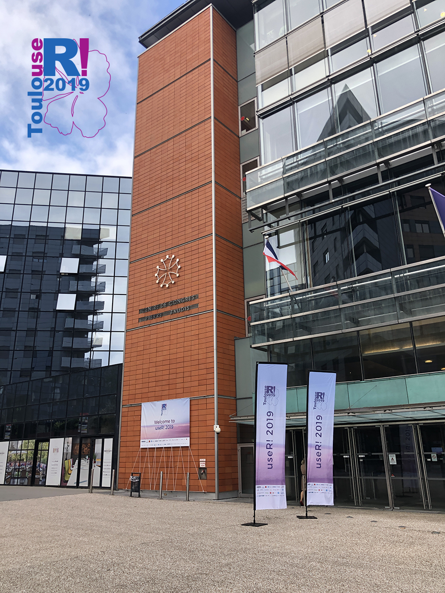
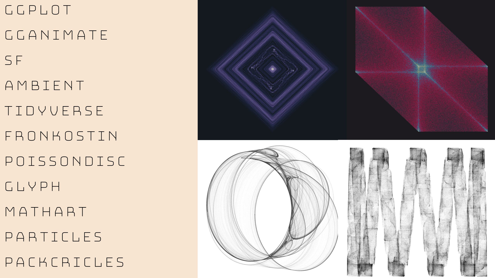
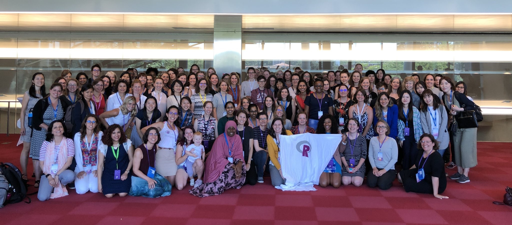

```{r setup, include=FALSE}
options(htmltools.dir.version = FALSE)
library(ggplot2)
library(plotly)
library(dplyr)
livedemosign <- function(top, left, deg) {
  htmltools::div("Live Demo!", class="faa-flash animated",
                 style=glue::glue("border:solid; border-color:black; position:absolute; top:{top}%; left:{left}%; font-size:36px; padding:4px; background-color:white; color:black;transform:rotate({deg}deg);")
                 )
}

```

class: split-40 hide-slide-number with-thick-border border-white
background-image: url("bkg/bg1.png")
background-size: cover

.column[.content.vmiddle.center[


]]
.column.shade_main[.content.vmiddle[

<br>

# .large[My experience at useR!2019]
## A lightning talk for RLadies Sydney
## first birthday! 

<br>

### Sarah Romanes  `r anicon::faa('twitter', animate = 'float', rtext='sarah_romanes', color='white')` 

<br>

### 31 July 2019

### `r anicon::faa('link', animate='vertical', rtext='&nbsp;bit.ly/RLadies-Birthday', color='white')`


]]
---

class: split-two white

.column.bg-main1[.content[

<br>

# .orange[**useR!2019**]

<br>

### .orange[**Who**:] `r icon::fa("r-project", size=1)` enthusiasts from around the world.

### .orange[**What**:] a collection of workshops, talks, poster sessions, and many other `r icon::fa("r-project", size=1)` related things! 

### .orange[**Where**:] Toulouse, France

### .orange[**When**:] July 9-12, 2019

### .orange[**Why**:] I was fortunate to be able to present an oral presentation about my discriminant analysis packages for `r icon::fa("r-project", size=1)`.

<br>

### *All of the talks can be found [here](https://user2019.r-project.org/talk_schedule/)*.

]]

.column[.content.vmiddle.center[


 


]]


---

class: middle center white

# .purple[**Highlight - generating art with `r icon::fa("r-project", size=1)` ([Will Chase](https://www.williamrchase.com/))**]

 


---

class: middle center bg-main1

# .white[**R Ladies Global!**]

 

---

class: split-three white


.column[.content.vmiddle.center[


]]

.column.bg-main1[.content.center[

<br>

# Some less academic highlights of useR!

<br>

## .white[`r anicon::faa('angle-double-left', animate='float', size=1)`] Conference Dinner

### *Canapes, cheese, and live music at Cité de l'espace*

<br>

<br>


##  Catering .white[`r anicon::faa('angle-double-right', animate='float', size=1)`]

### *Doughnuts, macarons, and tea galore*

]]

.column[.content.vmiddle.center[


]]


---

class: split-two white

.column.bg-main1[.content[

<br>

# .orange[**useR! or rstudio::conf?**]

<br>

## If you are thinking about going to an `r icon::fa("r-project", size=1)` conference in 2020, it's good to consider both useR! and rstudio::conf. Both are US based next year.

<br>

### .orange[useR!2020] will be held in St Louis in July, 2020.

### .orange[rstudio::conf] will be held in San Francisco in January, 2020.

]]

.column[.content.vmiddle.center[

### .purple[In the words of Hadley himself... ]

<br>

<center>

<blockquote class="twitter-tweet" data-conversation="none"><p lang="en" dir="ltr">useR is a bit smaller in terms of participants but has many more talks. It tends to have more academics where RSConf has more people from industry. Both have a strong commitment to diversity &amp; inclusion. In the spectrum of confs, I think they’re fairly close.</p>&mdash; Hadley Wickham (@hadleywickham) <a href="https://twitter.com/hadleywickham/status/1151079481114812416?ref_src=twsrc%5Etfw">July 16, 2019</a></blockquote> <script async src="https://platform.twitter.com/widgets.js" charset="utf-8"></script>

</center>

]]
