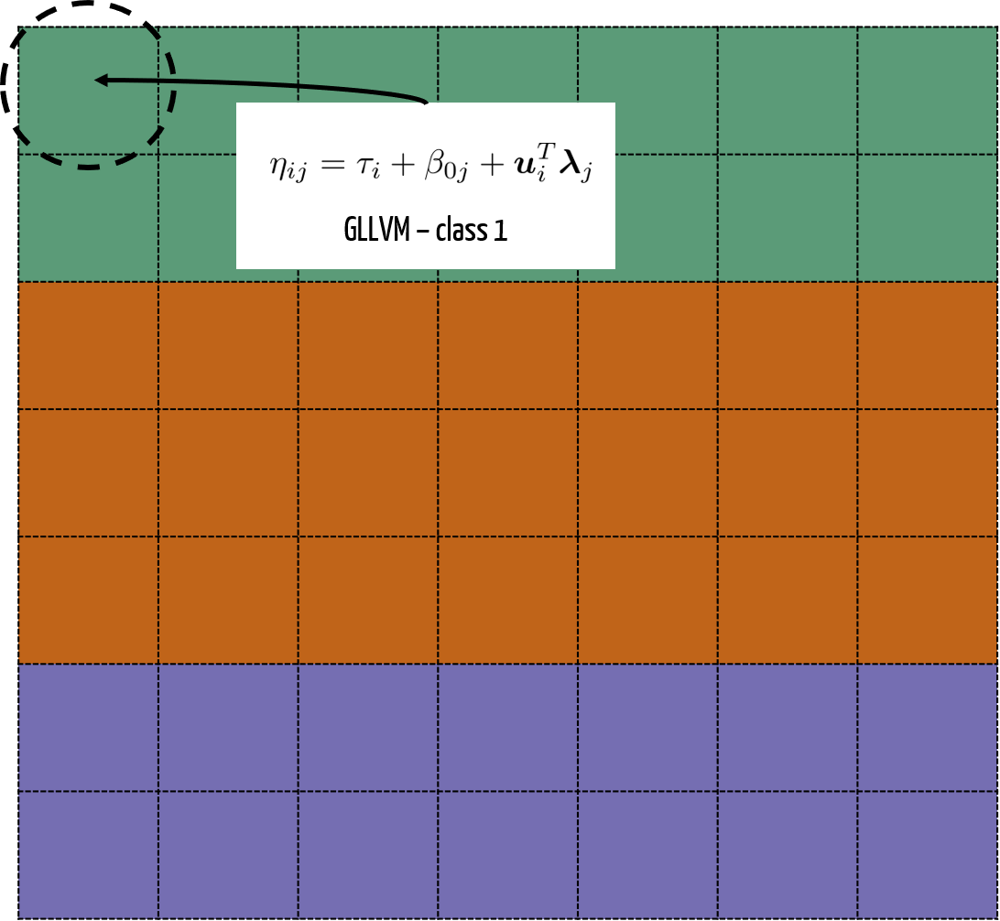
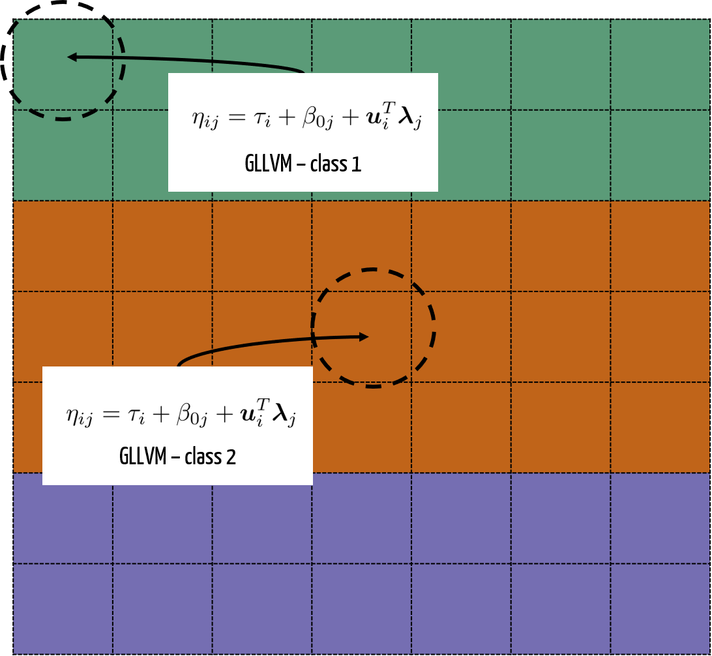
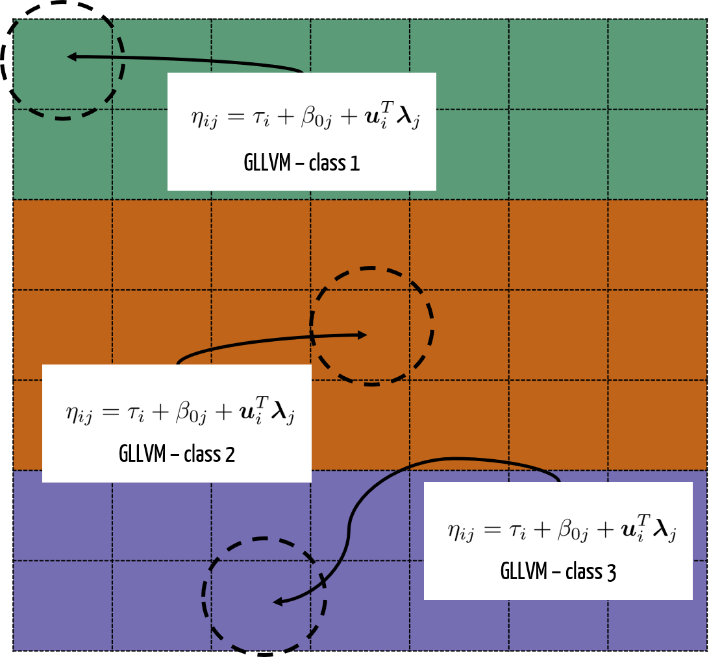

```{r setup, include=FALSE}
options(htmltools.dir.version = FALSE)
library(ggplot2)
library(plotly)
library(dplyr)
livedemosign <- function(top, left, deg) {
  htmltools::div("Live Demo!", class="faa-flash animated",
                 style=glue::glue("border:solid; border-color:black; position:absolute; top:{top}%; left:{left}%; font-size:36px; padding:4px; background-color:white; color:black;transform:rotate({deg}deg);")
                 )
}

```


class: split-70 hide-slide-number
background-image: url("bkg/bg2.jpg")
background-size: cover

.column.slide-in-left[
.sliderbox.vmiddle.shade_main.center[
.font5[Discriminant Analysis]]]
.column[
]


---
class: split-two white

.column.bg-main2[.content[

<br>

# What is Discriminant Analysis?

<br>

### -  Discriminant Analysis (Fisher, 1936) is a ML technique that seeks to find a linear combination of features that separates classes of objects.
<br>

### -  It *strictly* assumes the conditional distribution of the data, given class grouping, is .orange[multivariate normal].

<br>

### -  Available through `MASS` package in `r icon::fa("r-project", size=1)` with functions `lda` (common covariance) and `qda`. 


]]
.column[.content.vmiddle.center[


```{r, fig.retina=4, echo=FALSE, warning=FALSE, message=FALSE}
library(tidyverse)
library(mvtnorm)

s <- matrix(c(4,2,2,3), ncol = 2)
s1 <- matrix(c(3, -0.6,-0.6, 1), ncol=2)
s2 <- matrix(c(2,-0.08,-0.08,1), ncol = 2)

m1 <- c(0, 0)
m2 <- c(-3, 4)
m3 <- c(2,3)
n <- 1000

set.seed(42)
x1 <- rmvnorm(n = n, mean = m1, sigma = s2)
x2 <- rmvnorm(n = n, mean = m2, sigma = s1)
x3 <- rmvnorm(n = n, mean = m3, sigma = s)


d <- data.frame(rbind(x1,x2,x3))
d$class <- as.factor(rep(c("1", "2", "3"), each = 1000))

p2 <- ggplot(d, aes(x = X1, y = X2, group = class, color =class)) +
  geom_point(alpha = .5) +
  geom_density_2d() + 
  scale_colour_brewer(palette = "Dark2") +
  theme(text = element_text(size=20))

p2
  
```


 

]]


---

class: split-two white

.column.bg-main2[.content[

<br>

# Issues with DA

<br>

## **Does not work in high dimensions**

<br>

## DA does not work when p>n due to a required covariance inverse being singular.

<br>

## .orange[Solution? **multiDA**]

]]
.column.bg-main5[.content[

<br>

<br>

<br>

# .black[**Does not work for non-Gaussian response**]

<br>

## .black[Cannot use for count/ skewed/ binary/ mixed response data, etc.]

<br>

## .orange[Solution? **genDA**]
]]


---


class: split-70 hide-slide-number
background-image: url("bkg/bg2.jpg")
background-size: cover

.column.slide-in-left[
.sliderbox.vmiddle.shade_main.center[
.font5[multiDA]]]
.column[
]
---

class: split-two white

.column.bg-main2[.content[

<br>

# SRBCT data


]]
.column[.content.vmiddle.center[


 

.purple[Source:] [Nature](https://www.nature.com/articles/modpathol2016119)


]]


---

class: middle center bg-main2

# Pipeline

---

class: split-two white

.column.bg-main2[.content.vmiddle.center[

# So, what makes a discriminative feature?


Suppose we have 3 classes to model. We could group them as 

*One group*... (aka, NOT a discriminative feature)

]]
.column[.content.vmiddle.center[

```{r, echo = FALSE, fig.retina=4, message = FALSE, warning = FALSE}


library(ggplot2)
funcShaded <- function(x,m,s) {
  y <- dnorm(x, mean = m, sd = s)
  return(y)
}


s_a = 0.15
m_a =0.4

p5 <- ggplot(data.frame(x = c(-0.2, 1)), aes(x = x)) +
  stat_function(fun = dnorm, args = list(m_a, s_a),
                aes(colour = "Groups 1 + 2 + 3"), size = 1.5) +
  stat_function(fun=funcShaded, args = list(m_a, s_a), geom="area", fill="#1b9e77", alpha=0.5) +
  scale_x_continuous(name = "Value",
                     breaks = seq(-0.2, 1, 0.2),
                     limits=c(-0.2, 1)) +
  scale_y_continuous(name = "Density") +
  scale_colour_brewer(palette="Dark2") +
  labs(colour = "Groups") +
  theme_bw() +
  theme(legend.position = "bottom",
        panel.border = element_blank(),
        text = element_text(size=20))

p5
```


]]


---

class: split-two white

.column.bg-main2[.content.vmiddle.center[

# So, what makes a discriminative feature?

**Two groups** group 1 against 2 and 3


]]
.column[.content.vmiddle.center[


```{r, echo = FALSE, fig.retina=4, message = FALSE, warning = FALSE}

m_a = 0.25
m_b = 0.5


s_a = 0.15
s_b = 0.1

p3 <- ggplot(data.frame(x = c(-0.2, 1)), aes(x = x)) +
  stat_function(fun = dnorm, args = list(m_a, s_a),
                aes(colour = "Group 1"), size = 1.5) +
  stat_function(fun = dnorm, args = list(m_b, s_b),
                aes(colour = "Groups 2 & 3"), size = 1.5) +
  stat_function(fun=funcShaded, args = list(m_a, s_a), geom="area", fill="#1b9e77", alpha=0.5) +
  stat_function(fun=funcShaded, args = list(m_b, s_b), geom="area", fill="#d95f02", alpha=0.5) +
  scale_x_continuous(name = "Value",
                     breaks = seq(-0.2, 1, 0.2),
                     limits=c(-0.2, 1)) +
  scale_y_continuous(name = "Density") +
  scale_colour_brewer(palette="Dark2") +
  labs(colour = "Groups") +
  theme_bw() +
  theme(legend.position = "bottom",
        panel.border = element_blank(),
        text = element_text(size=20))

p3

```


]]


---

class: split-two white

.column.bg-main2[.content.vmiddle.center[

# So, what makes a discriminative feature?

**Two groups** group 2 against 1 and 3


]]
.column[.content.vmiddle.center[

```{r, echo = FALSE, fig.retina=4, message = FALSE, warning = FALSE}

m_a = 0.25
m_b = 0.5


s_a = 0.1
s_b = 0.15

p3 <- ggplot(data.frame(x = c(-0.2, 1)), aes(x = x)) +
  stat_function(fun = dnorm, args = list(m_a, s_a),
                aes(colour = "Group 2"), size = 1.5) +
  stat_function(fun = dnorm, args = list(m_b, s_b),
                aes(colour = "Groups 1 & 3"), size = 1.5) +
  stat_function(fun=funcShaded, args = list(m_a, s_a), geom="area", fill="#1b9e77", alpha=0.5) +
  stat_function(fun=funcShaded, args = list(m_b, s_b), geom="area", fill="#d95f02", alpha=0.5) +
  scale_x_continuous(name = "Value",
                     breaks = seq(-0.2, 1, 0.2),
                     limits=c(-0.2, 1)) +
  scale_y_continuous(name = "Density") +
  scale_colour_brewer(palette="Dark2") +
  labs(colour = "Groups") +
  theme_bw() +
  theme(legend.position = "bottom",
        panel.border = element_blank(),
        text = element_text(size=20))

p3

```


]]


---

class: split-two white

.column.bg-main2[.content.vmiddle.center[

# So, what makes a discriminative feature?


... and **Two groups** group 3 against 1 and 2

]]
.column[.content.vmiddle.center[

```{r, echo = FALSE, fig.retina=4, message = FALSE, warning = FALSE}

m_a = 0.25
m_b = 0.5


s_a = 0.1
s_b = 0.1

p3 <- ggplot(data.frame(x = c(-0.2, 1)), aes(x = x)) +
  stat_function(fun = dnorm, args = list(m_a, s_a),
                aes(colour = "Group 3"), size = 1.5) +
  stat_function(fun = dnorm, args = list(m_b, s_b),
                aes(colour = "Groups 1 & 2"), size = 1.5) +
  stat_function(fun=funcShaded, args = list(m_a, s_a), geom="area", fill="#1b9e77", alpha=0.5) +
  stat_function(fun=funcShaded, args = list(m_b, s_b), geom="area", fill="#d95f02", alpha=0.5) +
  scale_x_continuous(name = "Value",
                     breaks = seq(-0.2, 1, 0.2),
                     limits=c(-0.2, 1)) +
  scale_y_continuous(name = "Density") +
  scale_colour_brewer(palette="Dark2") +
  labs(colour = "Groups") +
  theme_bw() +
  theme(legend.position = "bottom",
        panel.border = element_blank(),
        text = element_text(size=20))

p3

```


]]


---

class: split-two white

.column.bg-main2[.content.vmiddle.center[

# So, what makes a discriminative feature?

... and finally, **three groups** (all are different).


]]
.column[.content.vmiddle.center[

```{r, echo = FALSE, fig.retina=4, message = FALSE, warning = FALSE}

m_a = 0.3
m_b = 0.4
m_c = 0.7

s_a = 0.19
s_b = 0.07
s_c = 0.1

p1 <- ggplot(data.frame(x = c(-0.2, 1)), aes(x = x)) +
  stat_function(fun = dnorm, args = list(m_a, s_a),
                aes(colour = "Group 1"), size = 1.5) +
  stat_function(fun = dnorm, args = list(m_b, s_b),
                aes(colour = "Group 2"), size = 1.5) +
  stat_function(fun = dnorm, args = list(m_c, s_c),
                aes(colour = "Group 3"), size = 1.5) +
  stat_function(fun=funcShaded, args = list(m_a, s_a), geom="area", fill="#1b9e77", alpha=0.5) +
  stat_function(fun=funcShaded, args = list(m_b, s_b), geom="area", fill="#d95f02", alpha=0.5) +
  stat_function(fun=funcShaded, args = list(m_c, s_c), geom="area", fill="#7570b3", alpha=0.5) +
  scale_x_continuous(name = "Value",
                     breaks = seq(-0.2, 1, 0.2),
                     limits=c(-0.2, 1)) +
  scale_y_continuous(name = "Density") +
  scale_colour_brewer(palette="Dark2") +
  labs(colour = "Groups") +
  theme_bw() +
  theme(legend.position = "bottom",
        panel.border = element_blank(),
        text = element_text(size=20))


p1

```
]]

---

class: middle center white

# .black[A Penalised LRT is used to determine best fit for each feature]


---

class: split-two white

.column.bg-main2[.content[

<br>

# `multiDA` - syntax

<br>

```{r, eval = FALSE}
res <- multiDA(y = y, #<<
               X = X,
               penalty = "EBIC",
               equal.var = TRUE,
               set.options = "exhaustive")
```


]]
.column.bg-main5[.content.vmiddle.center[


]]

---

class: split-two white

.column.bg-main2[.content[

<br>

# `multiDA` - syntax

<br>

```{r, eval = FALSE}
res <- multiDA(y = y, 
               X = X, #<<
               penalty = "EBIC",
               equal.var = TRUE,
               set.options = "exhaustive")
```


]]
.column.bg-main5[.content.vmiddle.center[


]]
---

class: split-two white

.column.bg-main2[.content[

<br>

# `multiDA` - syntax

<br>

```{r, eval = FALSE}
res <- multiDA(y = y, 
               X = X,
               penalty = "EBIC", #<<
               equal.var = TRUE,
               set.options = "exhaustive")
```


]]
.column.bg-main5[.content.vmiddle.center[


]]
---

class: split-two white

.column.bg-main2[.content[

<br>

# `multiDA` - syntax

<br>

```{r, eval = FALSE}
res <- multiDA(y = y, 
               X = X,
               penalty = "EBIC",
               equal.var = TRUE, #<<
               set.options = "exhaustive")
```


]]
.column.bg-main5[.content.vmiddle.center[


]]

---

class: split-two white

.column.bg-main2[.content[

<br>

# `multiDA` - syntax

<br>

```{r, eval = FALSE}
res <- multiDA(y = y, 
               X = X,
               penalty = "EBIC",
               equal.var = TRUE,
               set.options = "exhaustive") #<<
```


]]
.column.bg-main5[.content.vmiddle.center[


]]

---

class: split-two white

.column.bg-main2[.content[

<br>

# `multiDA` - syntax

<br>

```{r, eval = FALSE}
res <- multiDA(y = y, 
               X = X,
               penalty = "EBIC",
               equal.var = TRUE,
               set.options = "exhaustive") 
```

<br>

```{r, eval = FALSE}
predict(res, newdata = newdata) #<<
```


]]
.column.bg-main5[.content.vmiddle.center[


### A generic S3 `predict` method is used for prediction as follows

]]

---
class: middle center 

# CV results

---

class: split-70 hide-slide-number
background-image: url("bkg/bg2.jpg")
background-size: cover

.column.slide-in-left[
.sliderbox.vmiddle.shade_main.center[
.font5[genDA]]]
.column[
]
---

class: split-two white

.column.bg-main2[.content.vmiddle.center[

# Urban Cover data


]]
.column[.content.vmiddle.center[


]]


---

class: split-two white

.column.bg-main2[.content.vmiddle.center[

# Urban Cover data


]]
.column[.content.vmiddle.center[

 


]]

---

class: split-two white

.column.bg-main2[.content.vmiddle.center[

# GLLVM


]]
.column[.content[

```{r, eval = FALSE}
# A tibble: 168 x 148
   class    BrdIndx  Area Round Bright Compact ShpIndx Mean_G
   <fct>      <dbl> <int> <dbl>  <dbl>   <dbl>   <dbl>  <dbl>  
 1 car         1.27    91  0.97   231.    1.39    1.47   208.  
 2 concrete    2.36   241  1.56   216.    2.46    2.51   188.  
 3 concrete    2.12   266  1.47   232.    2.07    2.21   207. 
 4 concrete    2.42   399  1.28   230.    2.49    2.73   205. 
 5 concrete    2.15   944  1.73   193.    2.28    4.1    166. 
 6 tree        3.11   169  1.47   172.    2.49    3.35   240.  
 7 car         1.2     44  0.79   209.    1.14    1.36   181. 
 8 car         1       88  0.22   235.    1.11    1.12   208. 
 9 building    1.59  1737  0.67   220.    1.3     1.64   186. 
10 tree        2.37   153  1.3    120.    2.85    2.59   184.


#"log-normal"        "negative-binomial" "log-normal"        "log-normal"        "log-normal"        "log-normal"        "log-normal"    
```


]]


---

class: split-33 with-thick-border

.column.bg-main2[.content.vmiddle.center[

# GLLVM matrix


]]
.column[.content.vmiddle.center[


 


]]

---
class: split-33 with-thick-border

.column.bg-main2[.content.vmiddle.center[

# GLLVM matrix


]]
.column[.content.vmiddle.center[


 


]]

---

class: split-33 with-thick-border

.column.bg-main2[.content.vmiddle.center[

# GLLVM matrix


]]
.column[.content.vmiddle.center[


 


]]

---

class: split-two white

.column.bg-main2[.content.vmiddle.center[

# TMB package


]]
.column[.content[


]]

---

class: split-two white

.column.bg-main2[.content[

<br>

# `genDA` - syntax

<br>

```{r, eval = FALSE}
res <- genDA(Y = Y, #<<
            class = class,
            num.lv = 2,
            family = family,
            common.covariance = TRUE,
            row.eff = FALSE,
            standard.errors = FALSE)
```


]]
.column.bg-main5[.content.vmiddle.center[


]]

---

class: split-two white

.column.bg-main2[.content[

<br>

# `genDA` - syntax

<br>

```{r, eval = FALSE}
res <- genDA(Y = Y, 
            class = class, #<<
            num.lv = 2,
            family = family,
            common.covariance = TRUE,
            row.eff = FALSE,
            standard.errors = FALSE)
```


]]
.column.bg-main5[.content.vmiddle.center[


]]

---

class: split-two white

.column.bg-main2[.content[

<br>

# `genDA` - syntax

<br>

```{r, eval = FALSE}
res <- genDA(Y = Y, 
            class = class,
            num.lv = 2, #<<
            family = family,
            common.covariance = TRUE,
            row.eff = FALSE,
            standard.errors = FALSE)
```


]]
.column.bg-main5[.content.vmiddle.center[


]]

---

class: split-two white

.column.bg-main2[.content[

<br>

# `genDA` - syntax

<br>

```{r, eval = FALSE}
res <- genDA(Y = Y, 
            class = class,
            num.lv = 2,
            family = family, #<<
            common.covariance = TRUE,
            row.eff = FALSE,
            standard.errors = FALSE)
```


]]
.column.bg-main5[.content.vmiddle.center[


]]

---

class: split-two white

.column.bg-main2[.content[

<br>

# `genDA` - syntax

<br>

```{r, eval = FALSE}
res <- genDA(Y = Y, 
            class = class,
            num.lv = 2,
            family = family,
            common.covariance = TRUE, #<<
            row.eff = FALSE,
            standard.errors = FALSE)
```


]]
.column.bg-main5[.content.vmiddle.center[


]]

---
class: split-two white

.column.bg-main2[.content[

<br>

# `genDA` - syntax

<br>

```{r, eval = FALSE}
res <- genDA(Y = Y, 
            class = class,
            num.lv = 2,
            family = family,
            common.covariance = TRUE,
            row.eff = FALSE, #<<
            standard.errors = FALSE)
```


]]
.column.bg-main5[.content.vmiddle.center[


]]

---

class: split-two white

.column.bg-main2[.content[

<br>

# `genDA` - syntax

<br>

```{r, eval = FALSE}
res <- genDA(Y = Y, 
            class = class,
            num.lv = 2,
            family = family,
            common.covariance = TRUE,
            row.eff = FALSE,
            standard.errors = FALSE) #<<
```


]]
.column.bg-main5[.content.vmiddle.center[


]]

---

class: split-two white

.column.bg-main2[.content[

<br>

# `genDA` - syntax

<br>

```{r, eval = FALSE}
res <- genDA(Y = Y, 
            class = class,
            num.lv = 2,
            family = family,
            common.covariance = TRUE,
            row.eff = FALSE,
            standard.errors = FALSE) 
```


<br>

```{r, eval = FALSE}
predict(res, newdata = newdata) #<<
```


]]
.column.bg-main5[.content.vmiddle.center[


### A generic S3 `predict` method is used for prediction as follows

]]

---

class: middle center white

# .black[100 Trial, 5 Fold CV]

```{r, message = FALSE, warning = FALSE, echo = FALSE, fig.retina=4, fig.width=12}
load("data/urban.RData")
library(ggthemes)
library(ochRe)
ggplot(results, aes(x=method, y=(1-value)*100 )) + 
  geom_boxplot(aes(fill=method))+
  scale_fill_ochre("namatjira_div")+
  theme_hc()+
  theme(text = element_text(size=18), legend.position = "none") + ylab("Accuracy (%)") + xlab(" ") 
```


---
class: split-three white


.column.bg-main3[.content.center[

<br>

<br>

<br>


### `r icon::fa("twitter")` : sarah_romanes
### `r icon::fa("globe")` : sarahromanes.github.io

]]

.column.bg-main2[.content.center[

<br>

# genDA

<br>


## .white[`r anicon::faa('github', animate='float', size=1)`]

### [sarahromanes/genDA](https://github.com/sarahromanes/genDA)


]]

.column.bg-main5[.content.center[

<br>

# .black[multiDA]

<br>


## .black[`r anicon::faa('github', animate='float', size=1)`]

### [sarahromanes/multiDA](https://github.com/sarahromanes/multiDA)

]]

