```{r setup, include=FALSE}
options(htmltools.dir.version = FALSE)
library(ggplot2)
library(plotly)
library(dplyr)
livedemosign <- function(top, left, deg) {
  htmltools::div("Live Demo!", class="faa-flash animated",
                 style=glue::glue("border:solid; border-color:black; position:absolute; top:{top}%; left:{left}%; font-size:36px; padding:4px; background-color:white; color:black;transform:rotate({deg}deg);")
                 )
}

```


class: split-40 hide-slide-number with-thick-border border-white
background-image: url("bkg/bg1.png")
background-size: cover

.column[.content.vmiddle.center[


]]
.column.shade_main[.content.vmiddle[

<br>

# .large[multiDA and genDA]
## Discriminant Analysis Methods for Large Scale 
## and Complex Datasets

<br>

### Sarah Romanes  `r anicon::faa('twitter', animate = 'float', rtext='sarah_romanes', color='white')` 

<br>

### useR!2019

### `r anicon::faa('link', animate='vertical', rtext='&nbsp;bit.ly/SR-useR-2019', color='white')`


]]

---

class: split-two white

.column.bg-main2[.content[

<br>

# Acknowledgements


<br>
<br>

### - This work is in collaboration with my supervisor A/Prof John Ormerod.

<br>

### - Big thanks to my research group at the University of Sydney, as well as NUMBATS from Monash for input in package design.

<br>

### - Slides are made in `rmarkdown` using `xaringan` (Yihui Xie) and *ninja* theme (Emi Tanaka).


]]
.column[.content.vmiddle.center[


 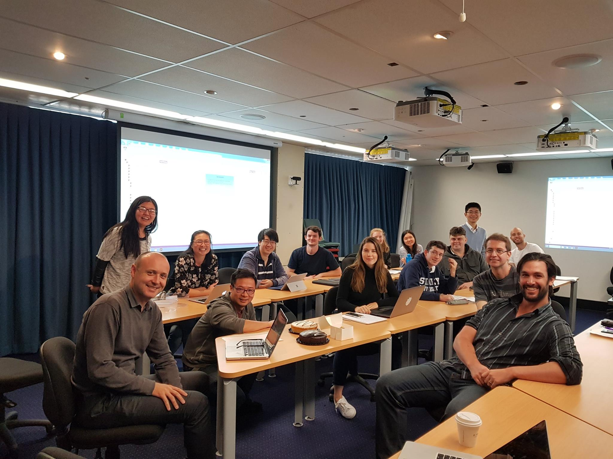


]]


---


class: split-70 hide-slide-number
background-image: url("bkg/bg2.png")
background-size: cover

.column.slide-in-left[
.sliderbox.vmiddle.shade_main.center[
.font5[Discriminant Analysis]]]
.column[
]


---
class: split-two white

.column.bg-main2[.content[

<br>

# **What is Discriminant Analysis?**

<br>

### -  Discriminant Analysis (Fisher, 1936) is a ML technique that seeks to find a linear combination of features that separates classes of objects.
<br>

### -  It *strictly* assumes the conditional distribution of the data, given class grouping, is .orange[multivariate normal].

<br>

### -  Available through `MASS` package in `r icon::fa("r-project", size=1)` with functions `lda` (common covariance) and `qda`. 


]]
.column[.content.vmiddle.center[


```{r, fig.retina=4, echo=FALSE, warning=FALSE, message=FALSE}
library(tidyverse)
library(mvtnorm)

s <- matrix(c(4,2,2,3), ncol = 2)
s1 <- matrix(c(3, -0.6,-0.6, 1), ncol=2)
s2 <- matrix(c(2,-0.08,-0.08,1), ncol = 2)

m1 <- c(0, 0)
m2 <- c(-3, 4)
m3 <- c(2,3)
n <- 1000

set.seed(42)
x1 <- rmvnorm(n = n, mean = m1, sigma = s2)
x2 <- rmvnorm(n = n, mean = m2, sigma = s1)
x3 <- rmvnorm(n = n, mean = m3, sigma = s)


d <- data.frame(rbind(x1,x2,x3))
d$class <- as.factor(rep(c("1", "2", "3"), each = 1000))

p2 <- ggplot(d, aes(x = X1, y = X2, group = class, color =class)) +
  geom_point(alpha = .5) +
  geom_density_2d() + 
  scale_colour_brewer(palette = "Dark2") +
  theme(text = element_text(size=20))

p2
  
```


 

]]


---

class: split-two white

.column.bg-main2[.content[

<br>

# **Issues with DA**

<br>

## **Does not work in high dimensions**

<br>

## DA does not work when p>n due to a required covariance inverse being singular.

<br>

## .orange[**Solution?** *multiDA*]

]]
.column.bg-main5[.content[

<br>

<br>

<br>

# .black[**Does not work for non-Gaussian response**]

<br>

## .black[Cannot use for count/ skewed/ binary/ mixed response data, etc.]

<br>

## .orange[**Solution?** *genDA*]
]]


---


class: split-70 hide-slide-number
background-image: url("bkg/bg2.png")
background-size: cover

.column.slide-in-left[
.sliderbox.vmiddle.shade_main.center[
.font5[multiDA]]]
.column[
]
---

class: split-two white

.column.bg-main2[.content[

<br>

# **SRBCT data**


<br>

### - The SRBCT dataset (Khan et al., 2001) looks at classifying 4 classes of different childhood tumours sharing similar visual features during routine histology.

### - Data contains 83 microarray samples with 1586 features.

<br>

## .orange[**Q:** How can we use DA to find important features that discriminate between the classes, and use them to predict cancer type?]


]]
.column[.content.vmiddle.center[


 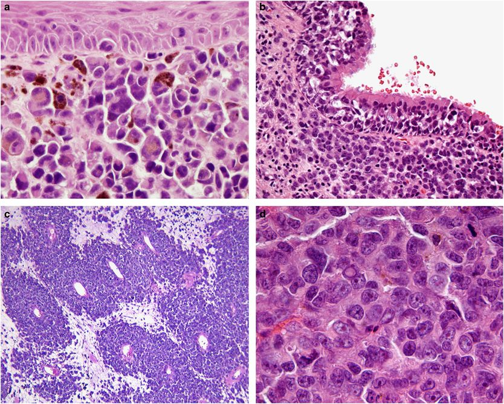

.purple[Source:] [Nature](https://www.nature.com/articles/modpathol2016119)


]]


---

class: middle center bg-main2


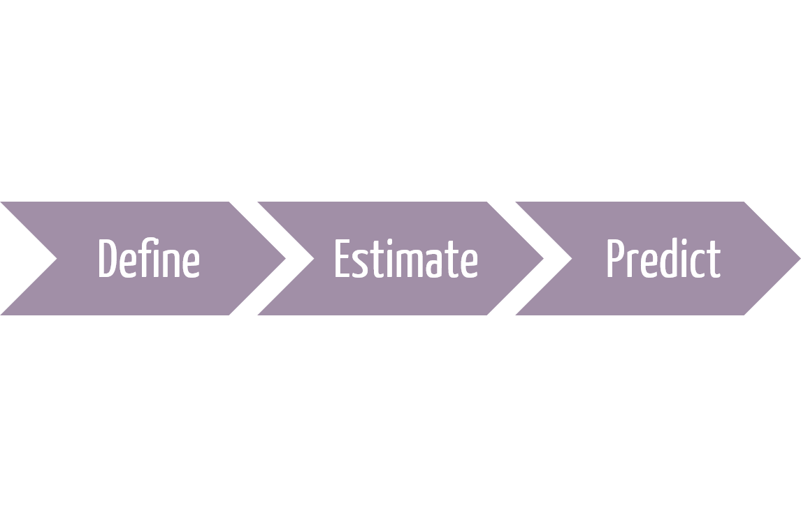

---

class: split-two white

.column.bg-main2[.content[
  .split-two[
 .row[.content[

<br>
 # **What defines a discriminative feature?**
 
  
<br>

        
## Suppose we have 3 classes to model. If we assume the features are independent,  within each feature we can group them as:

 ]]
  .row[.content.vmiddle.center[

## .orange[**One group**] (NOT a discriminative feature)

 ]]

 ]
]]
.column[.content.vmiddle.center[

```{r, echo = FALSE, fig.retina=4, message = FALSE, warning = FALSE}


library(ggplot2)
funcShaded <- function(x,m,s) {
  y <- dnorm(x, mean = m, sd = s)
  return(y)
}


s_a = 0.15
m_a =0.4

p5 <- ggplot(data.frame(x = c(-0.2, 1)), aes(x = x)) +
  stat_function(fun = dnorm, args = list(m_a, s_a),
                aes(colour = "Groups 1 + 2 + 3"), size = 1.5) +
  stat_function(fun=funcShaded, args = list(m_a, s_a), geom="area", fill="#1b9e77", alpha=0.5) +
  scale_x_continuous(name = "Value",
                     breaks = seq(-0.2, 1, 0.2),
                     limits=c(-0.2, 1)) +
  scale_y_continuous(name = "Density") +
  scale_colour_brewer(palette="Dark2") +
  labs(colour = "Groups") +
  theme_bw() +
  theme(legend.position = "bottom",
        panel.border = element_blank(),
        text = element_text(size=20))

p5
```


]]


---

class: split-two white


.column.bg-main2[.content[
  .split-two[
 .row[.content[

<br>
 # **What defines a discriminative feature?**
 
  
<br>

## Suppose we have 3 classes to model. If we assume the features are independent,  within each feature we can group them as:


 ]]
  .row[.content.vmiddle.center[

## .orange[**Two groups**] (Groups 2 and 3, against 1)

 ]]

 ]
]]


.column[.content.vmiddle.center[


```{r, echo = FALSE, fig.retina=4, message = FALSE, warning = FALSE}

m_a = 0.25
m_b = 0.5


s_a = 0.15
s_b = 0.1

p3 <- ggplot(data.frame(x = c(-0.2, 1)), aes(x = x)) +
  stat_function(fun = dnorm, args = list(m_a, s_a),
                aes(colour = "Group 1"), size = 1.5) +
  stat_function(fun = dnorm, args = list(m_b, s_b),
                aes(colour = "Groups 2 & 3"), size = 1.5) +
  stat_function(fun=funcShaded, args = list(m_a, s_a), geom="area", fill="#1b9e77", alpha=0.5) +
  stat_function(fun=funcShaded, args = list(m_b, s_b), geom="area", fill="#d95f02", alpha=0.5) +
  scale_x_continuous(name = "Value",
                     breaks = seq(-0.2, 1, 0.2),
                     limits=c(-0.2, 1)) +
  scale_y_continuous(name = "Density") +
  scale_colour_brewer(palette="Dark2") +
  labs(colour = "Groups") +
  theme_bw() +
  theme(legend.position = "bottom",
        panel.border = element_blank(),
        text = element_text(size=20))

p3

```


]]


---

class: split-two white

.column.bg-main2[.content[
  .split-two[
 .row[.content[

<br>
 # **What defines a discriminative feature?**
 
  
<br>
        
## Suppose we have 3 classes to model. If we assume the features are independent,  within each feature we can group them as:


 ]]
  .row[.content.vmiddle.center[

## .orange[**Two groups**] (Groups 1 and 3, against 2)

 ]]

 ]
]]
.column[.content.vmiddle.center[

```{r, echo = FALSE, fig.retina=4, message = FALSE, warning = FALSE}

m_a = 0.25
m_b = 0.5


s_a = 0.1
s_b = 0.15

p3 <- ggplot(data.frame(x = c(-0.2, 1)), aes(x = x)) +
  stat_function(fun = dnorm, args = list(m_a, s_a),
                aes(colour = "Group 2"), size = 1.5) +
  stat_function(fun = dnorm, args = list(m_b, s_b),
                aes(colour = "Groups 1 & 3"), size = 1.5) +
  stat_function(fun=funcShaded, args = list(m_a, s_a), geom="area", fill="#1b9e77", alpha=0.5) +
  stat_function(fun=funcShaded, args = list(m_b, s_b), geom="area", fill="#d95f02", alpha=0.5) +
  scale_x_continuous(name = "Value",
                     breaks = seq(-0.2, 1, 0.2),
                     limits=c(-0.2, 1)) +
  scale_y_continuous(name = "Density") +
  scale_colour_brewer(palette="Dark2") +
  labs(colour = "Groups") +
  theme_bw() +
  theme(legend.position = "bottom",
        panel.border = element_blank(),
        text = element_text(size=20))

p3

```


]]


---

class: split-two white

.column.bg-main2[.content[
  .split-two[
 .row[.content[

<br>
 # **What defines a discriminative feature?**
 
  
<br>

## Suppose we have 3 classes to model. If we assume the features are independent,  within each feature we can group them as:


 ]]
  .row[.content.vmiddle.center[

## .orange[**Two groups**] (Groups 1 and 2, against 3)

 ]]

 ]
]]
.column[.content.vmiddle.center[

```{r, echo = FALSE, fig.retina=4, message = FALSE, warning = FALSE}

m_a = 0.25
m_b = 0.5


s_a = 0.1
s_b = 0.1

p3 <- ggplot(data.frame(x = c(-0.2, 1)), aes(x = x)) +
  stat_function(fun = dnorm, args = list(m_a, s_a),
                aes(colour = "Group 3"), size = 1.5) +
  stat_function(fun = dnorm, args = list(m_b, s_b),
                aes(colour = "Groups 1 & 2"), size = 1.5) +
  stat_function(fun=funcShaded, args = list(m_a, s_a), geom="area", fill="#1b9e77", alpha=0.5) +
  stat_function(fun=funcShaded, args = list(m_b, s_b), geom="area", fill="#d95f02", alpha=0.5) +
  scale_x_continuous(name = "Value",
                     breaks = seq(-0.2, 1, 0.2),
                     limits=c(-0.2, 1)) +
  scale_y_continuous(name = "Density") +
  scale_colour_brewer(palette="Dark2") +
  labs(colour = "Groups") +
  theme_bw() +
  theme(legend.position = "bottom",
        panel.border = element_blank(),
        text = element_text(size=20))

p3

```


]]


---

class: split-two white

.column.bg-main2[.content[
  .split-two[
 .row[.content[

<br>
 # **What defines a discriminative feature?**
 
  
<br>

## Suppose we have 3 classes to model. If we assume the features are independent,  within each feature we can group them as:

 ]]
  .row[.content.vmiddle.center[

## .orange[**Three groups**] (All groups are different)

 ]]

 ]
]]
.column[.content.vmiddle.center[

```{r, echo = FALSE, fig.retina=4, message = FALSE, warning = FALSE}

m_a = 0.3
m_b = 0.4
m_c = 0.7

s_a = 0.19
s_b = 0.07
s_c = 0.1

p1 <- ggplot(data.frame(x = c(-0.2, 1)), aes(x = x)) +
  stat_function(fun = dnorm, args = list(m_a, s_a),
                aes(colour = "Group 1"), size = 1.5) +
  stat_function(fun = dnorm, args = list(m_b, s_b),
                aes(colour = "Group 2"), size = 1.5) +
  stat_function(fun = dnorm, args = list(m_c, s_c),
                aes(colour = "Group 3"), size = 1.5) +
  stat_function(fun=funcShaded, args = list(m_a, s_a), geom="area", fill="#1b9e77", alpha=0.5) +
  stat_function(fun=funcShaded, args = list(m_b, s_b), geom="area", fill="#d95f02", alpha=0.5) +
  stat_function(fun=funcShaded, args = list(m_c, s_c), geom="area", fill="#7570b3", alpha=0.5) +
  scale_x_continuous(name = "Value",
                     breaks = seq(-0.2, 1, 0.2),
                     limits=c(-0.2, 1)) +
  scale_y_continuous(name = "Density") +
  scale_colour_brewer(palette="Dark2") +
  labs(colour = "Groups") +
  theme_bw() +
  theme(legend.position = "bottom",
        panel.border = element_blank(),
        text = element_text(size=20))


p1

```
]]

---

class: middle center white

# .black[A Penalised LRT is used to **estimate** the best fit for each feature]

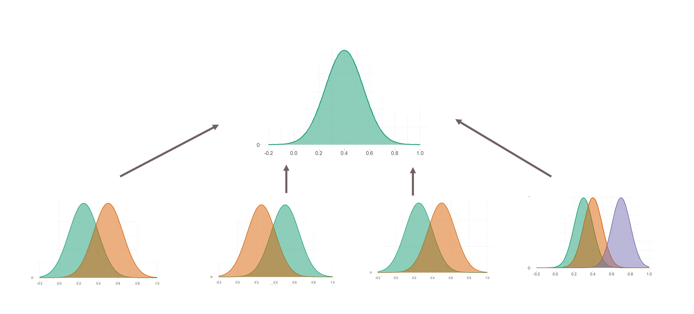

---

class: split-two white

.column.bg-main2[.content[

<br>

# `multiDA` - syntax

<br>

```{r, eval = FALSE}
res <- multiDA(y = y, #<<
               X = X,
               penalty = "EBIC",
               equal.var = TRUE,
               set.options = "exhaustive")
```


]]
.column.bg-main5[.content.vmiddle.center[

### `y` - vector of factor class values (for training)

]]

---

class: split-two white

.column.bg-main2[.content[

<br>

# `multiDA` - syntax

<br>

```{r, eval = FALSE}
res <- multiDA(y = y, 
               X = X, #<<
               penalty = "EBIC",
               equal.var = TRUE,
               set.options = "exhaustive")
```


]]
.column.bg-main5[.content.vmiddle.center[


### `X` - 	matrix containing the training data. The rows are the sample observations, and the columns are the features.
]]
---

class: split-two white

.column.bg-main2[.content[

<br>

# `multiDA` - syntax

<br>

```{r, eval = FALSE}
res <- multiDA(y = y, 
               X = X,
               penalty = "EBIC", #<<
               equal.var = TRUE,
               set.options = "exhaustive")
```


]]
.column.bg-main5[.content.vmiddle.center[

### `penalty` - default `EBIC`,  which penalises based on the number of features and degrees of freedom of groupings. If option `penalty="BIC"` is specified, the penalty reverts back to the BIC.


]]
---

class: split-two white

.column.bg-main2[.content[

<br>

# `multiDA` - syntax

<br>

```{r, eval = FALSE}
res <- multiDA(y = y, 
               X = X,
               penalty = "EBIC",
               equal.var = TRUE, #<<
               set.options = "exhaustive")
```


]]
.column.bg-main5[.content.vmiddle.center[

### `equal.var` - indicating whether group specific variances should be equal or allowed to vary.


]]

---

class: split-two white

.column.bg-main2[.content[

<br>

# `multiDA` - syntax

<br>

```{r, eval = FALSE}
res <- multiDA(y = y, 
               X = X,
               penalty = "EBIC",
               equal.var = TRUE,
               set.options = "exhaustive") #<<
```


]]
.column.bg-main5[.content.vmiddle.center[


### `set.options` - this determines what groupings we want to consider. For example, for 15 classes, there are 1, 382, 958, 545 ways the classes can be grouped together. However if we consider `set.options = "onevsrest"`, we only consider groupings of one class vs the others, resulting in 16 possible combinations. 

]]

---

class: split-two white

.column.bg-main2[.content[

<br>

# `multiDA` - syntax

<br>

```{r, eval = FALSE}
res <- multiDA(y = y, 
               X = X,
               penalty = "EBIC",
               equal.var = TRUE,
               set.options = "exhaustive") 
```

<br>

```{r, eval = FALSE}
obj <- predict(res, newdata = newdata) #<<

```


]]
.column.bg-main5[.content.vmiddle.center[


### Finally, a generic S3 `predict` method is used for prediction. `obj$y.pred` returns class labels, and `obj$probabilities` returns probablities of class membership for each class.

]]

---

class: split-two white

.column.bg-main2[.content[

<br>

# Application to `SRBCT` data

<br>

```{r, eval = FALSE}
res <- multiDA(y = SRBCT$y, 
               X = SRBCT$X,
               penalty = "EBIC",
               equal.var = TRUE,
               set.options = "exhaustive") 
```

<br>

### We first have a look at a summary of the model by using `print()`:

```{r, eval = FALSE}
print(res) #<<
```


]]
.column[.content.vmiddle[

```{r, eval = FALSE}
Sample Size:
[1] 63
Number of Features:
[1] 1586
Classes:
[1] 4
Equal Variance Assumption:
[1] TRUE
Number of Significant Features:
[1] 215
Summary of Significant Features:
  rank feature.ID gamma.hat partition
1     1      V1172 0.9997741         8
2     2      V1232 0.9997576         4
3     3      V1233 0.9997563         3
4     4      V1324 0.9997506         3
5     5       V706 0.9997441         5
6     6       V434 0.9997437         3
7     7       V527 0.9997424         3
8     8      V1189 0.9997368         3
9     9      V1166 0.9997347         7
10   10       V148 0.9997342         4
```


]]


---
class: split-two white

.column.bg-main2[.content[

<br>

# Application to `SRBCT` data

<br>

```{r, eval = FALSE}
res <- multiDA(y = SRBCT$y, 
               X = SRBCT$X,
               penalty = "EBIC",
               equal.var = TRUE,
               set.options = "exhaustive") 
```

<br>

### We can then examine the class groupings using the `plot()` method for `multiDA`:

```{r, eval = FALSE}
plot(res, ranks= 1) #<<
```


]]
.column[.content.vmiddle.center[

```{r, echo = FALSE, message = FALSE, warning = FALSE, fig.retina=4}
library(multiDA)
library(ggplot2)
res <- multiDA(y = SRBCT$y, 
               X = SRBCT$X,
               penalty = "EBIC",
               equal.var = TRUE,
               set.options = "exhaustive") 
plot(res, ranks = 1)
```


]]


---
class: middle center white

# .black[100 Trial, 5 Fold CV]

```{r, message = FALSE, warning = FALSE, echo = FALSE, fig.retina=4, fig.width=12}


load("data/SRBCT.RData")
data$as.factor.ours.=as.factor(data$as.factor.ours.)
library(ggthemes)
library(ochRe)
p10 <- ggplot(data, aes(x = labels, y = 1-vals, fill=as.factor.ours.)) +
              geom_boxplot() +
              scale_fill_manual(values = c("thistle4","thistle3"))+
              theme_hc() +
              theme(legend.position="none",
                    text = element_text(size=18)) +ylab("Accuracy (%)") + xlab(" ") 
    

p10

```


---

class: split-70 hide-slide-number
background-image: url("bkg/bg2.png")
background-size: cover

.column.slide-in-left[
.sliderbox.vmiddle.shade_main.center[
.font5[genDA]]]
.column[
]
---

class: split-two white

.column.bg-main2[.content[

<br>

# **Urban Cover data**

<br>

### - The study area is an urban area in Deerfield Beach, FL, USA, with a 30cm resolution colour infrared aerial orthoimagery of the study area acquired.

<br>

### - Contains 9 different types of landcover.

<br> 

### - Data consists of .orange[n = 168] image segments to be classified with .orange[m = 147] features associated with each image segment such as Area, Brightness, etc measured at different resolutions.

]]
.column[.content.vmiddle.center[

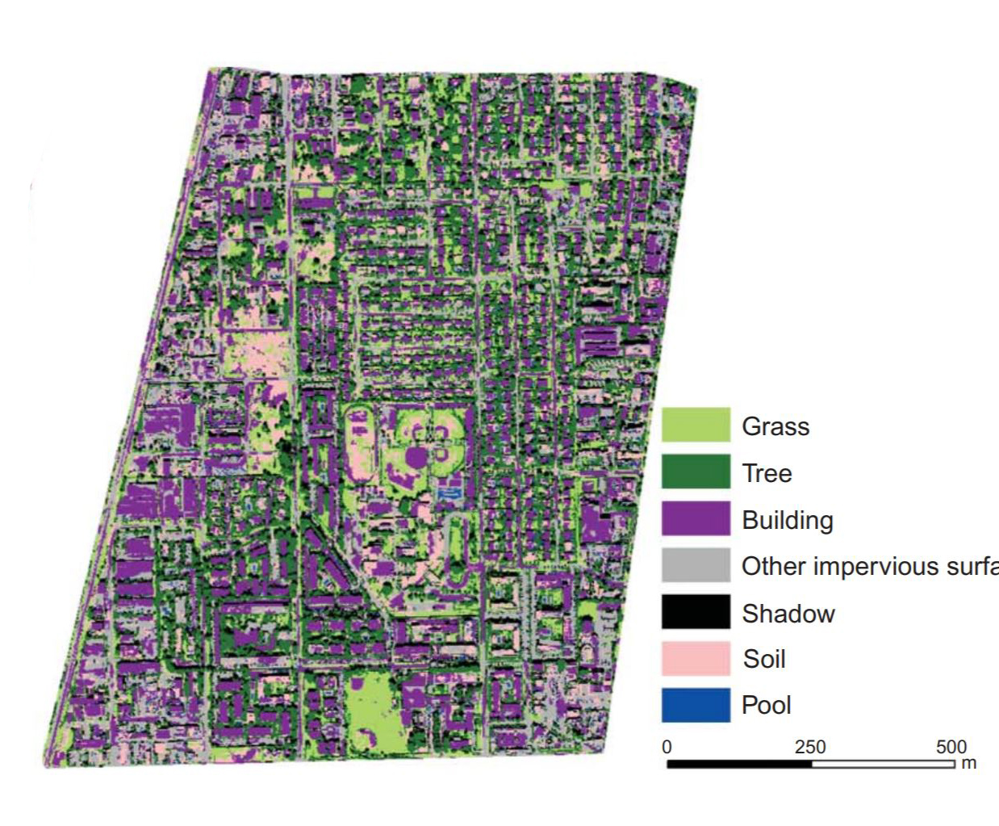

##### .pink[Source: Johnson, 2013].

]]


---

class: split-two white

.column.bg-main2[.content[


<br>

# **Urban Cover data**

<br>

<br>

<br>

# Data is *highly correlated* with a noticible difference in correlation structure between classes.


]]
.column[.content.vmiddle.center[

 


]]

---

class: split-two white

.column.bg-main2[.content[

<br>

# **Urban Cover data**

<br>


# EDA shows that data is .orange[not normal], with a mix of positive skew and count data.


<br>

## .orange[**Q:** How can we build a DA model to discriminate between segment types, for data of mixed response types?]


]]
.column[.content.vmiddle[

```{r, eval = FALSE}
# A tibble: 168 x 148
   class    BrdIndx  Area Round Bright Compact ShpIndx 
   <fct>      <dbl> <int> <dbl>  <dbl>   <dbl>   <dbl>  
 1 car         1.27    91  0.97   231.    1.39    1.47
 2 concrete    2.36   241  1.56   216.    2.46    2.51    
 3 concrete    2.12   266  1.47   232.    2.07    2.21
 4 concrete    2.42   399  1.28   230.    2.49    2.73 
 5 concrete    2.15   944  1.73   193.    2.28    4.1 
 6 tree        3.11   169  1.47   172.    2.49    3.35  
 7 car         1.2     44  0.79   209.    1.14    1.36 
 8 car         1       88  0.22   235.    1.11    1.12 
 9 building    1.59  1737  0.67   220.    1.3     1.64 
10 tree        2.37   153  1.3    120.    2.85    2.59
```


]]


---


class: split-33 

.column.bg-main2[.content[

<br>

# ** GLLVMs **

<br>

## We can fit a DA model to this data as follows. By first deciding on a family of distributions for each column, 


]]
.column[.content.vmiddle.center[


 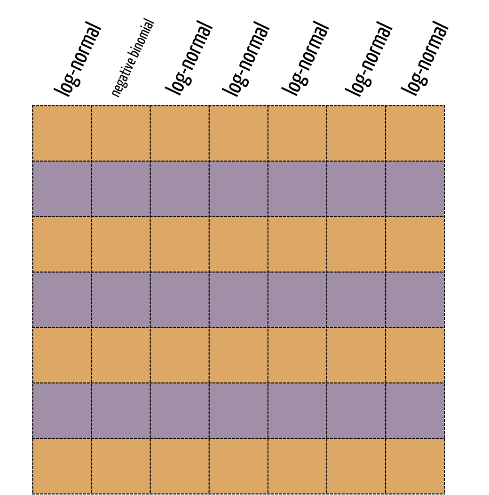


]]

---
class: split-33 

.column.bg-main2[.content[

<br>

# ** GLLVMs **

<br>

## we use a .orange[GLLVM] to model the distribution for each column, taking into account class information and capturing the correlation between features.


]]
.column[.content.vmiddle.center[


 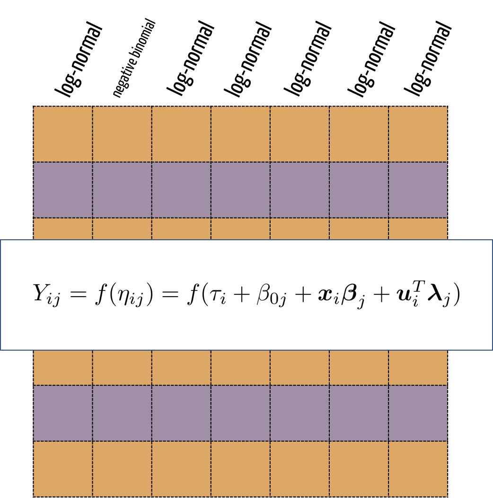


]]

---
class: split-33 

.column.bg-main2[.content[

<br>

# ** GLLVMs **

<br>

<br>

# $\Large{\tau_i}$ and $\Large{\beta_{0j}}$  represent row and column intercepts.


]]
.column[.content.vmiddle.center[


 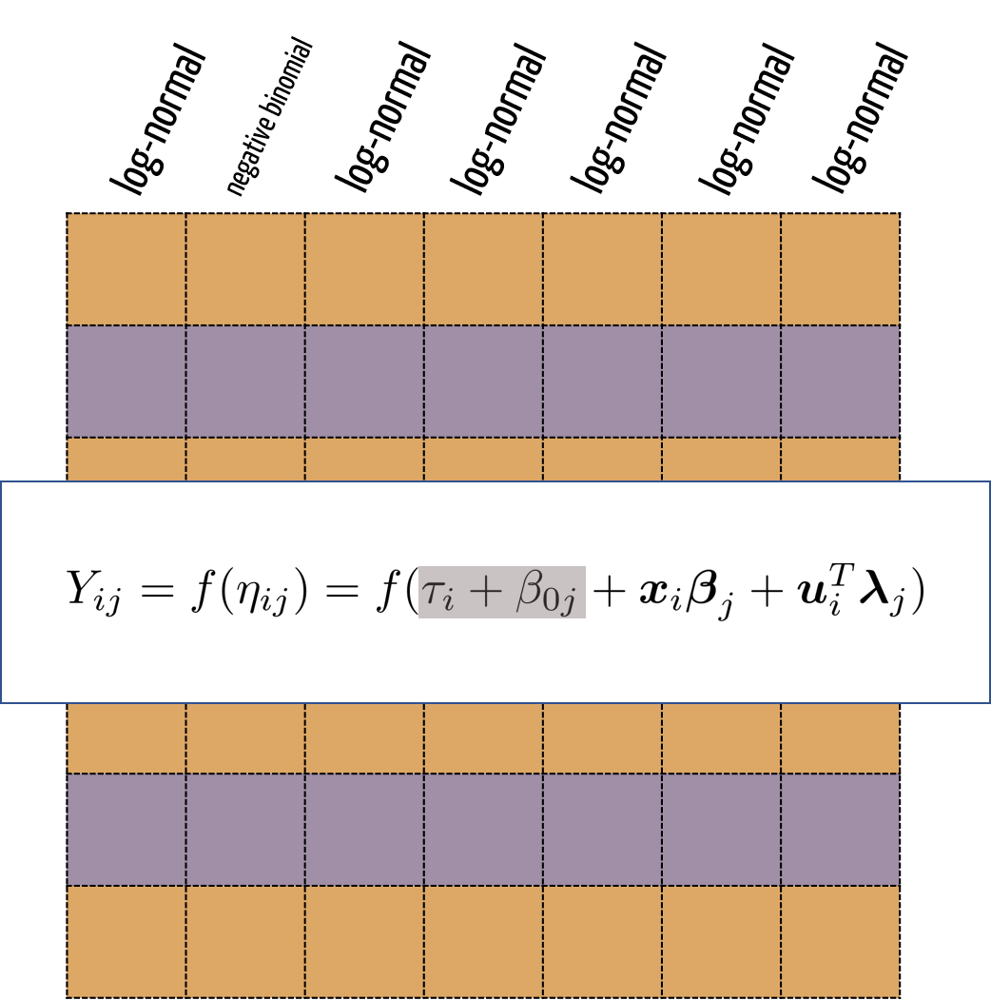


]]

---

class: split-33 

.column.bg-main2[.content[

<br>

# ** GLLVMs **

<br>

<br>

# Class information is captured in $\Large{\boldsymbol{x_i}}$, with corresponding coefficients $\Large{\boldsymbol{\beta_j}}$.


]]
.column[.content.vmiddle.center[


 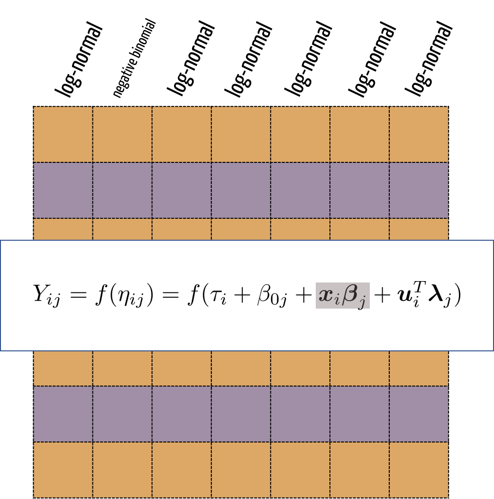


]]

---

class: split-33 

.column.bg-main2[.content[

<br>

# ** GLLVMs **

<br>

# Correlation structure is captured in $\Large{\boldsymbol{u_i}}$ (latent), with corresponding coefficients $\Large{\boldsymbol{\lambda_j}}$.


]]
.column[.content.vmiddle.center[


 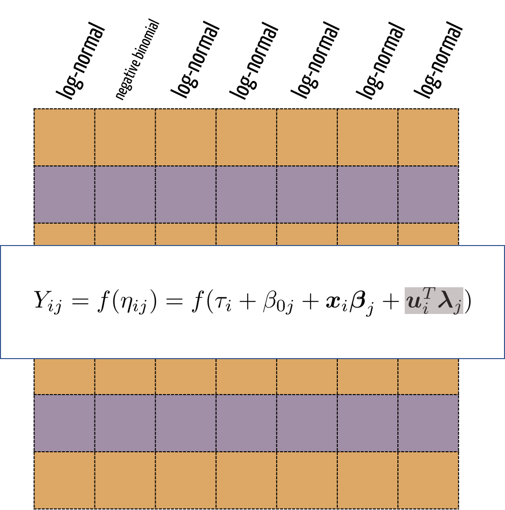


]]
---

class: split-33 

.column.bg-main2[.content[

<br>

# ** GLLVMs **

<br>

<br>

## We can model .orange[differing] correlation structures by fitting multiple GLLVMs for different classes.


]]
.column[.content.vmiddle.center[


 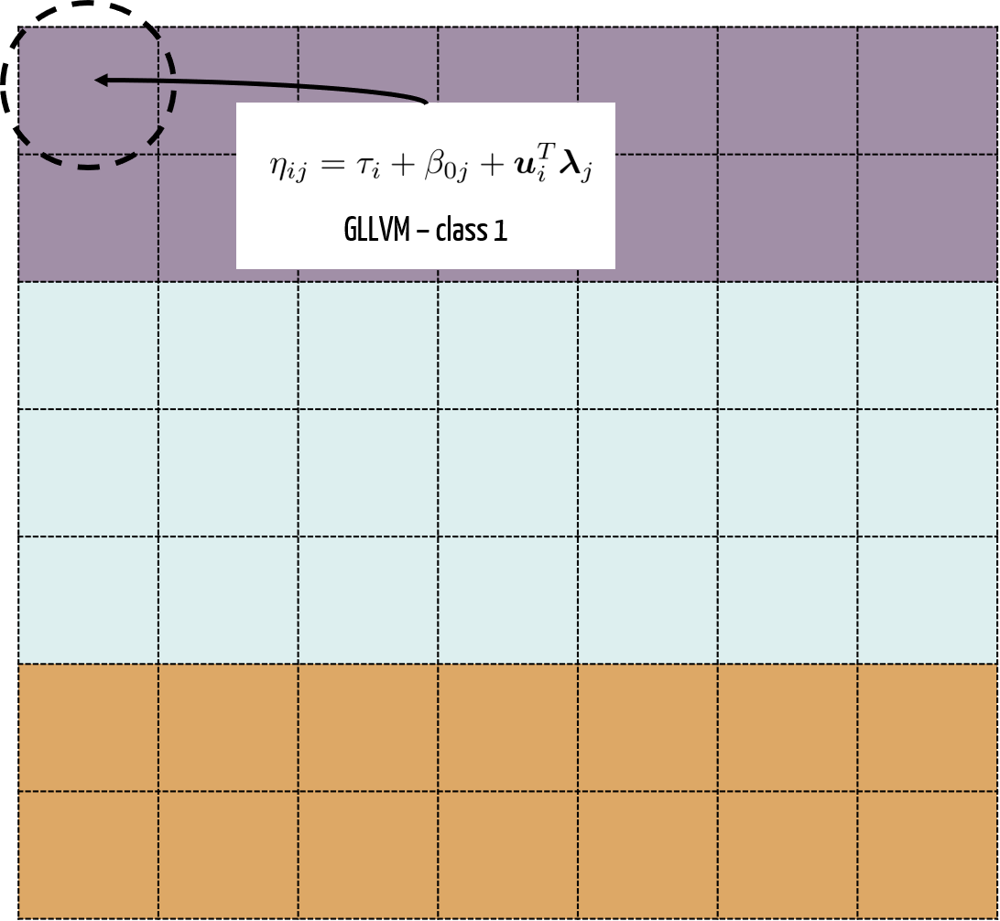


]]

---
class: split-33 

.column.bg-main2[.content[

<br>

# ** GLLVMs **

<br>

<br>

## We can model .orange[differing] correlation structures by fitting multiple GLLVMs for different classes.


]]
.column[.content.vmiddle.center[


 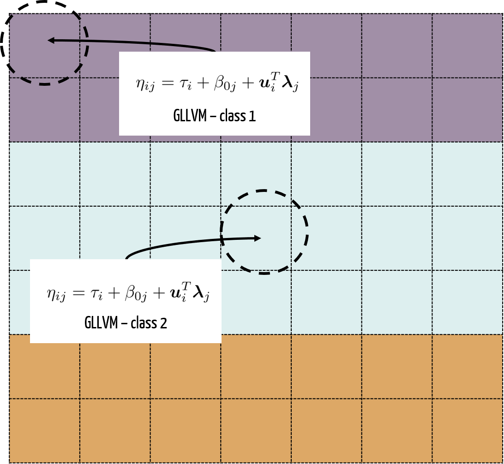


]]

---

class: split-33 

.column.bg-main2[.content[

<br>

# ** GLLVMs **

<br>

<br>


## We can model .orange[differing] correlation structures by fitting multiple GLLVMs for different classes.


]]
.column[.content.vmiddle.center[


 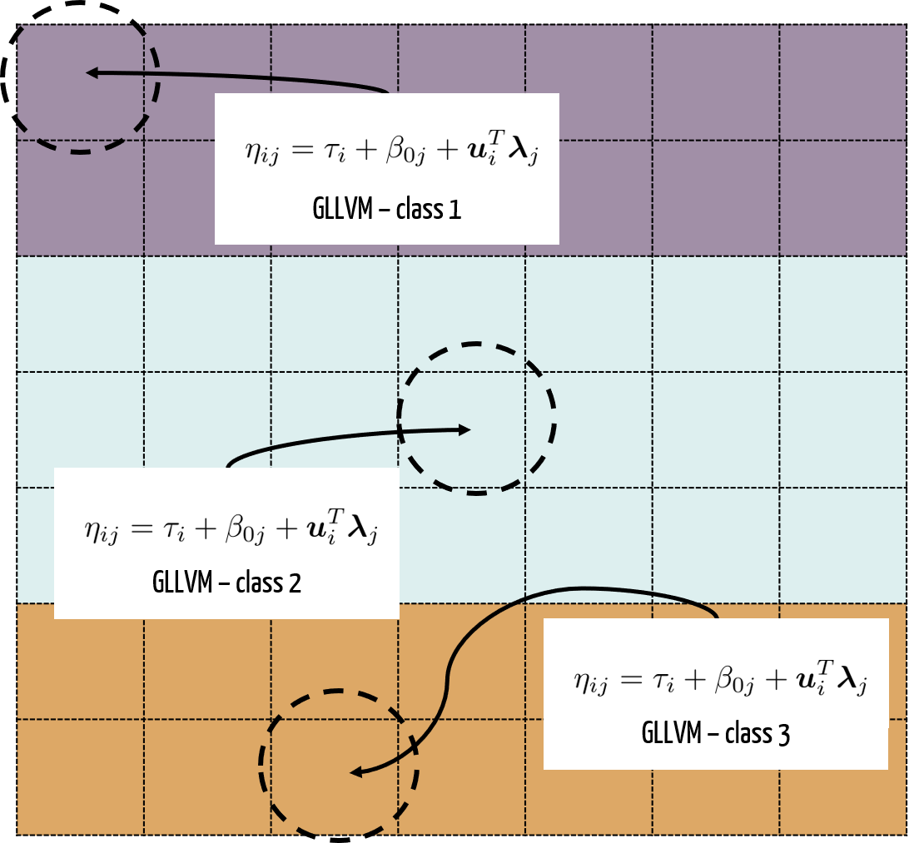


]]

---

class: split-two white

.column.bg-main2[.content[

<br>

# **Model Estimation**

<br>

### - We formulate a Bayesian GLLVM approach to train our classifier.

<br>
### - Marginalising over the latent variables proves to be intractable - so a Variational Approximation is used.
<br>
### - In the optimisation process, we utilise the `TMB` package, which allows us to perform .orange[Automatic Differentiation], implemented in `C++`. This allows our fitting process to be fast.

#### Read more about the mathematics [here](https://sarahromanes.github.io/talks/ACEMS/ACEMS_SarahRomanes.pdf).


]]
.column[.content.vmiddle.center[


 

]]

---

class: split-two white

.column.bg-main2[.content[

<br>

# `genDA` - syntax

<br>

```{r, eval = FALSE}
res <- genDA(Y = Y, #<<
            class = class,
            num.lv = 2,
            family = family,
            common.covariance = TRUE,
            row.eff = FALSE,
            standard.errors = FALSE)
```


]]
.column.bg-main5[.content.vmiddle.center[

### `Y` - 	a (n x m) `matrix` or `data.frame` of responses.


]]

---

class: split-two white

.column.bg-main2[.content[

<br>

# `genDA` - syntax

<br>

```{r, eval = FALSE}
res <- genDA(Y = Y, 
            class = class, #<<
            num.lv = 2,
            family = family,
            common.covariance = TRUE,
            row.eff = FALSE,
            standard.errors = FALSE)
```


]]
.column.bg-main5[.content.vmiddle.center[


### `class` - a factor vector of class information.

]]

---

class: split-two white

.column.bg-main2[.content[

<br>

# `genDA` - syntax

<br>

```{r, eval = FALSE}
res <- genDA(Y = Y, 
            class = class,
            num.lv = 2, #<<
            family = family,
            common.covariance = TRUE,
            row.eff = FALSE,
            standard.errors = FALSE)
```


]]
.column.bg-main5[.content.vmiddle.center[

### `num.lv` - number of latent variables in GLLVM model. Non-negative integer, less than the number of response variables (m). Defaults to 2.


]]

---

class: split-two white

.column.bg-main2[.content[

<br>

# `genDA` - syntax

<br>

```{r, eval = FALSE}
res <- genDA(Y = Y, 
            class = class,
            num.lv = 2,
            family = family, #<<
            common.covariance = TRUE,
            row.eff = FALSE,
            standard.errors = FALSE)
```


]]
.column.bg-main5[.content.vmiddle.center[


### `family` - character vector to describe the distribution of each column. Columns can be of different family types. Family options are `"poisson"` (with log link), `"ZIP"` (Zero Inflated Poisson), `"negative-binomial"` (with log link), `"binomial"` (with logit link), `"gaussian"`, and `"log-normal"`.

]]

---

class: split-two white

.column.bg-main2[.content[

<br>

# `genDA` - syntax

<br>

```{r, eval = FALSE}
res <- genDA(Y = Y, 
            class = class,
            num.lv = 2,
            family = family,
            common.covariance = TRUE, #<<
            row.eff = FALSE,
            standard.errors = FALSE)
```


]]
.column.bg-main5[.content.vmiddle.center[

### `common.covariance` - default `TRUE`. Specifies whether different covariance structures should be fit for each class.

]]

---
class: split-two white

.column.bg-main2[.content[

<br>

# `genDA` - syntax

<br>

```{r, eval = FALSE}
res <- genDA(Y = Y, 
            class = class,
            num.lv = 2,
            family = family,
            common.covariance = TRUE,
            row.eff = FALSE, #<<
            standard.errors = FALSE)
```


]]
.column.bg-main5[.content.vmiddle.center[

### `row.eff` - default `FALSE`. Specifies whether row effects should be included in model.


]]

---

class: split-two white

.column.bg-main2[.content[

<br>

# `genDA` - syntax

<br>

```{r, eval = FALSE}
res <- genDA(Y = Y, 
            class = class,
            num.lv = 2,
            family = family,
            common.covariance = TRUE,
            row.eff = FALSE,
            standard.errors = FALSE) #<<
```


]]
.column.bg-main5[.content.vmiddle.center[


### `standard.errors` - default `FALSE`. Indicates whether standard errors for training parameter estimates are calculated.

]]

---

class: split-two white

.column.bg-main2[.content[

<br>

# `genDA` - syntax

<br>

```{r, eval = FALSE}
res <- genDA(Y = Y, 
            class = class,
            num.lv = 2,
            family = family,
            common.covariance = TRUE,
            row.eff = FALSE,
            standard.errors = FALSE) 
```


<br>

```{r, eval = FALSE}
predict(res, newdata = newdata) #<<
```


]]
.column.bg-main5[.content.vmiddle.center[


### And finally, just as in `multiDA`, a generic S3 `predict` method is used for prediction.

]]

---

class: middle center white

# .black[100 Trial, 5 Fold CV]

```{r, message = FALSE, warning = FALSE, echo = FALSE, fig.retina=4, fig.width=12}
load("data/urban.RData")
library(ggthemes)
library(ochRe)
ggplot(results, aes(x=method, y=(1-value)*100 )) + 
  geom_boxplot(aes(fill=method))+
  scale_fill_ochre("namatjira_div")+
  theme_hc()+
  theme(text = element_text(size=18), legend.position = "none") + ylab("Accuracy (%)") + xlab(" ") 
```


---
class: split-three white


.column.bg-main3[.content.center[

<br>

<br>

<br>


### `r icon::fa("twitter")` : sarah_romanes
### `r icon::fa("globe")` : sarahromanes.github.io


]]

.column.bg-main2[.content.center[

<br>

# genDA

<br>

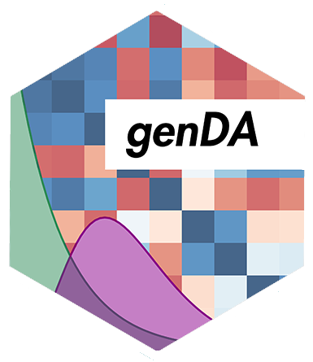

## .white[`r anicon::faa('github', animate='float', size=1)`]

### [sarahromanes/genDA](https://github.com/sarahromanes/genDA)


]]

.column.bg-main5[.content.center[

<br>

# .black[multiDA]

<br>


## .black[`r anicon::faa('github', animate='float', size=1)`]

### [sarahromanes/multiDA](https://github.com/sarahromanes/multiDA)

]]

